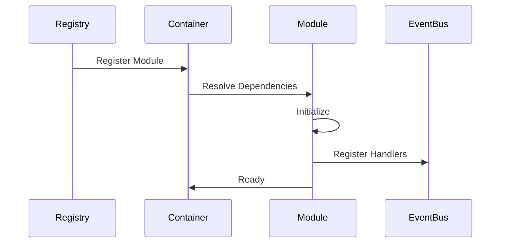
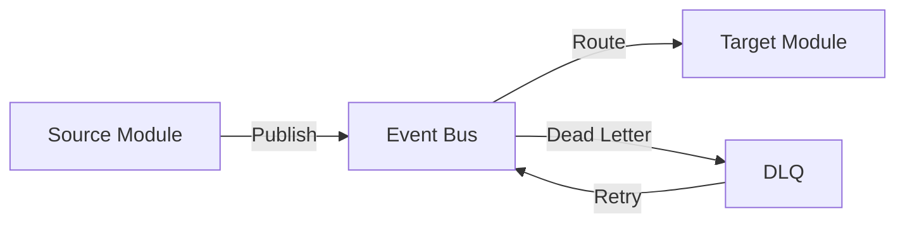
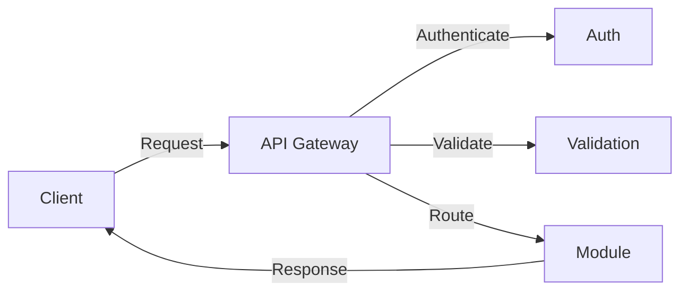
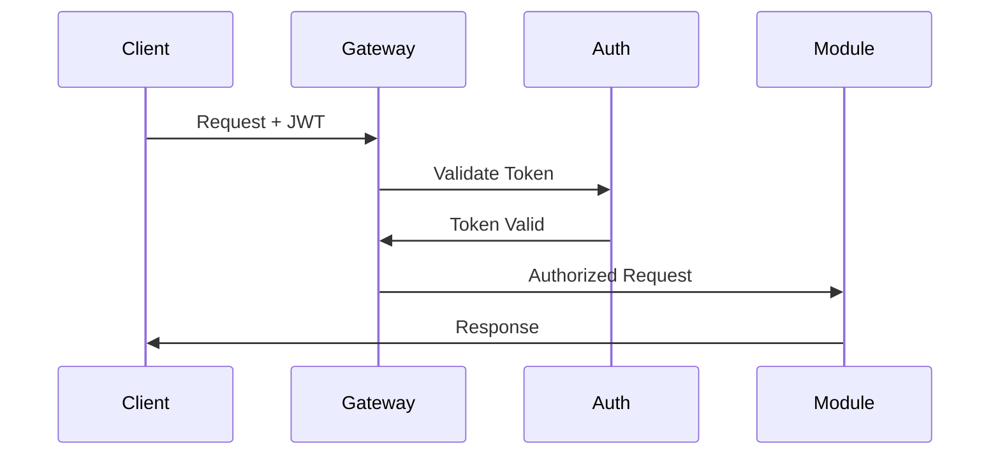
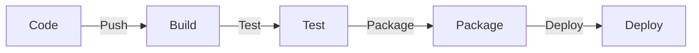
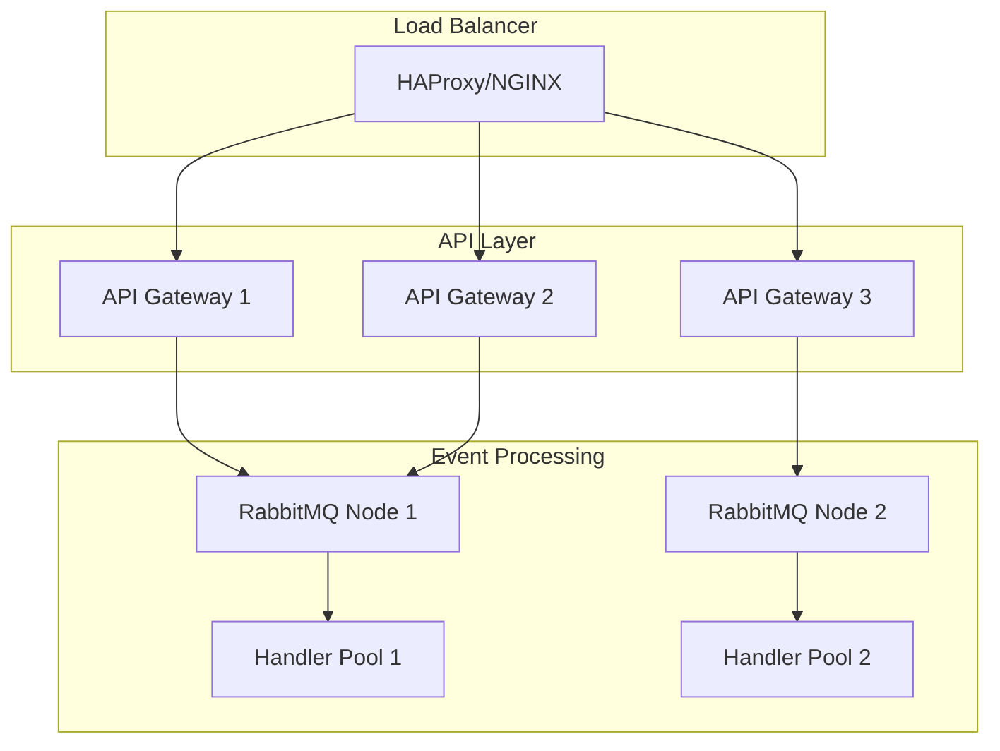
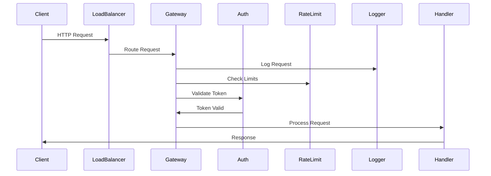
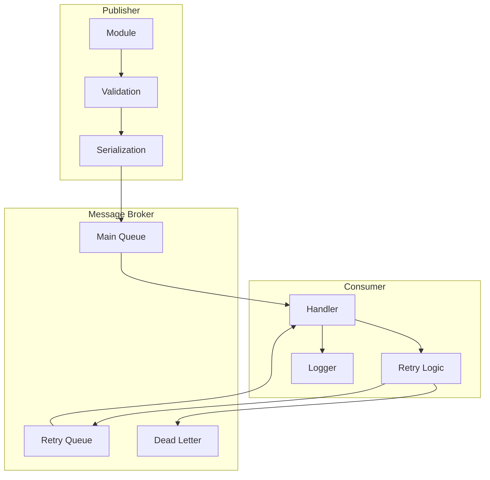
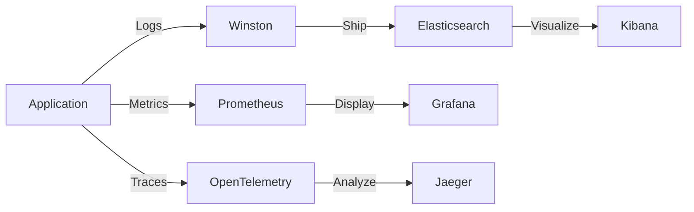
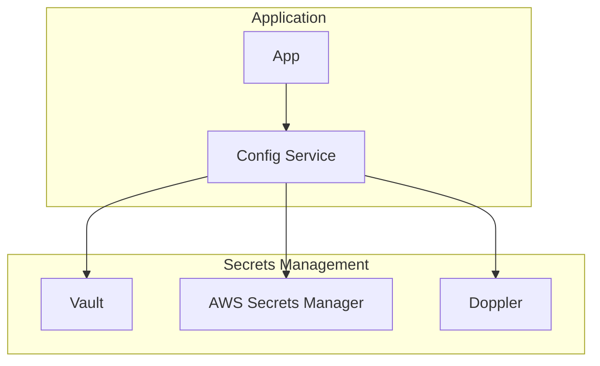

# Toro_SM Information System - Technical Documentation
Version 1.0.0

## Table of Contents
0. [Universal Error System](#0-universal-error-system)
1. [System Overview](#1-system-overview)
2. [System Architecture](#2-system-architecture)
3. [Core Components](#3-core-components)
4. [Module System](#4-module-system)
5. [Event-Driven Communication](#5-event-driven-communication)
6. [Database Architecture](#6-database-architecture)
7. [API Layer](#7-api-layer)
8. [Security](#8-security)
9. [Development & Deployment](#9-development--deployment)
10. [Directory Structure](#10-directory-structure)

## 0. Universal Error System

## 1. System Overview

### Introduction
Toro_SM is a comprehensive information system built on a hybrid modular architecture, combining a monolithic core with event-driven services. The system integrates various enterprise functionalities including Accounting, CRM, HR, Scheduling, Inventory, and more.

### Key Features
- Modular, event-driven system architecture
- Real-time data processing and updates
- Cross-module communication via event bus
- Integrated caching system
- Comprehensive security features
- SSR with Marko.js for optimal performance
- Hot Module Replacement with Vite

### Business Modules
- Accounting System
- Wiki System (Knowledge Base)
- Scheduling System (Teams, Staff, Equipment)
- Documentation System
- Inventory Management
- Project Management
- R&D System
- Forms Management
- Sales System
- CRM
- Human Resources

## 2. System Architecture

### High-Level Architecture Diagram
```mermaid
graph TB
    subgraph Frontend Layer
        UI[Marko UI Components]
        SSR[Server-Side Rendering]
    end
    
    subgraph Core Layer
        API[API Gateway]
        Auth[Authentication]
        Events[Event Bus]
        Cache[Cache Manager]
    end
    
    subgraph module Layer
        ACC[Accounting]
        HR[HR System]
        INV[Inventory]
        CRM[CRM]
        WIKI[Wiki]
        DOC[Documentation]
        PM[Project Mgmt]
    end
    
    subgraph Data Layer
        DB[(PostgreSQL)]
        CACHE[(Redis)]
        MQ[RabbitMQ]
    end

    UI --> SSR
    SSR --> API
    API --> Auth
    Auth --> Events
    Events --> Service Layer
    Service Layer --> Cache
    Cache --> Data Layer
```

### Key Components Table
| Component | Technology | Purpose |
|-----------|------------|----------|
| Frontend | Marko.js | SSR, UI Components |
| Build Tool | Vite | Development, Bundling |
| API Layer | Fastify | HTTP Interface |
| Event Bus | RabbitMQ | Inter-module Communication |
| Database | PostgreSQL | Primary Data Store |
| Cache | Redis | Performance Optimization |

## 3. Core Components

### Container (Dependency Injection)
The DI container manages component lifecycle and dependencies:

```javascript
class Container {
  // Core functionality
  async register(name, component)
  async resolve(name)
  async initialize()
  async shutdown()
}
```

### Module System
Base module structure for all business modules:

```javascript
class Module {
  static dependencies = [];
  
  constructor(deps)
  async initialize()
  async registerRoutes()
  async handleEvent(event)
}
```

### Registry
Manages module discovery and registration:

```javascript
class Registry {
  async discover(path)
  async register(module)
  async initialize()
}
```

### Event Bus
Handles inter-module communication:

```javascript
class EventBus {
  async publish(topic, data)
  async subscribe(topic, handler)
  async initialize()
}
```

## 4. Module System

### Module Lifecycle
1. Registration
2. Dependency Resolution
3. Initialization
4. Route Registration
5. Event Handler Registration
6. Runtime Operation
7. Shutdown

### Module Integration


## 5. Event-Driven Communication

### Event Flow


### Event Types
- System Events
- Business Events
- Error Events
- Audit Events

## 6. Database Architecture

### Schema Organization
```mermaid
graph TB
    subgraph Core Schema
        Users
        Audit
        Config
    end
    
    subgraph Module Schemas
        Accounting
        HR
        Inventory
    end
    
    Core Schema --> Module Schemas
```

### Caching Strategy
- Query Result Caching
- Session Data
- Temporary Data Storage
- Rate Limiting

## 7. API Layer

### Request Flow


### API Features
- Request Validation
- Rate Limiting
- Error Handling
- Response Formatting

## 8. Security

### Security Features
- JWT Authentication
- Role-Based Access Control
- Request Validation
- Rate Limiting
- CSRF Protection
- Security Headers

### Security Flow


## 9. Development & Deployment

### Development Workflow
1. Local Development
   - npm run dev
   - Vite HMR
   - Live Reload

2. Testing
   - Unit Tests
   - Integration Tests
   - E2E Tests

3. Deployment
   - Build Process
   - Container Creation
   - Service Deployment

### CI/CD Pipeline

[Previous sections remain the same until Section 9...]

## 9. Development & Deployment

[Previous content remains...]

## 10. Scaling & High Availability

### Horizontal Scaling


### Scaling Strategy
| Component | Scaling Method | Considerations |
|-----------|---------------|----------------|
| API Gateway | Horizontal | Stateless, behind load balancer |
| Event Handlers | Dynamic | Based on queue size |
| Database | Read Replicas | For read-heavy operations |
| Cache | Redis Cluster | Distributed caching |

### High Availability Setup
- Multiple API instances across availability zones
- RabbitMQ clusters with mirrored queues
- Database replication with automated failover
- Redis cluster with sentinel monitoring

## 11. API Gateway Architecture

### Request Flow Detail


### Route Configuration Example
```javascript
{
  "routes": {
    "/api/users": {
      "get": {
        "handler": "UserController.list",
        "middleware": ["auth", "rateLimit"],
        "validation": {
          "query": {
            "page": "number",
            "limit": "number"
          }
        },
        "response": {
          "200": {
            "type": "array",
            "items": "User"
          }
        }
      }
    }
  }
}
```

## 12. Event Processing System

### Event Handling Flow


### Retry Strategy
```javascript
{
  "retryPolicy": {
    "attempts": 3,
    "backoff": {
      "type": "exponential",
      "initial": 1000,
      "multiplier": 2,
      "maxDelay": 30000
    },
    "deadLetter": {
      "queue": "dlq.errors",
      "ttl": 604800 // 7 days
    }
  }
}
```

### Event Debugging
- Unique correlation IDs for request tracing
- Event payload versioning
- Comprehensive event logging
- Dead letter queue monitoring

## 13. Logging & Monitoring

### Logging Architecture


### Logging Configuration
```javascript
{
  "logging": {
    "levels": {
      "error": 0,
      "warn": 1,
      "info": 2,
      "debug": 3
    },
    "transports": [
      {
        "type": "console",
        "format": "json",
        "level": "info"
      },
      {
        "type": "elasticsearch",
        "level": "debug",
        "indexPattern": "toro-logs-YYYY.MM.DD"
      }
    ]
  }
}
```

### Monitoring Metrics
| Category | Metrics | Alert Threshold |
|----------|---------|-----------------|
| API | Response Time | > 500ms |
| API | Error Rate | > 1% |
| Event | Queue Size | > 1000 |
| Event | Processing Time | > 2s |
| Database | Connection Pool | > 80% |
| Cache | Hit Rate | < 80% |

## 14. Configuration & Secrets

### Configuration Hierarchy
1. Default Values
2. Configuration Files
3. Environment Variables
4. Secrets Management

### Secrets Management


### Environment Configuration
```javascript
{
  "config": {
    "sources": [
      {
        "type": "file",
        "path": "config/default.json"
      },
      {
        "type": "env",
        "prefix": "TORO_"
      },
      {
        "type": "vault",
        "path": "secrets/toro"
      }
    ],
    "schema": {
      "database": {
        "url": "string:secret",
        "pool": "object"
      },
      "api": {
        "key": "string:secret",
        "timeout": "number"
      }
    }
  }
}
```

## 15. Directory Structure

```
toro_sm/
├── src/
│   ├── core/           # Core system components
│   │   ├── container/  # Dependency injection
│   │   ├── events/     # Event system
│   │   ├── database/   # Database services
│   │   ├── cache/      # Caching services
│   │   └── security/   # Security services
│   ├── modules/        # Business modules
│   │   ├── accounting/
│   │   ├── hr/
│   │   ├── inventory/
│   │   └── ...
│   └── shared/         # Shared utilities
├── tests/             # Test files
├── docs/             # Documentation
└── scripts/          # Utility scripts
```

### File Organization
Each module follows a standard structure:
```
module/
├── index.js          # Module entry point
├── routes.js         # Route definitions
├── handlers.js       # Event handlers
├── models/           # Data models
├── services/         # Business logic
└── tests/           # Module tests
```