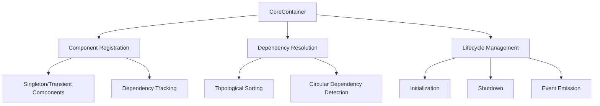

# CoreContainer System Documentation

## Table of Contents
1. [Overview](#overview)
2. [Purpose](#purpose)
3. [System Architecture](#system-architecture)
4. [Core Concepts](#core-concepts)
5. [Installation](#installation)
6. [Usage](#usage)
7. [Advanced Features](#advanced-features)
8. [Best Practices](#best-practices)
9. [Extending the System](#extending-the-system)
10. [Troubleshooting](#troubleshooting)

## Overview

The CoreContainer System is a sophisticated Dependency Injection (DI) and Inversion of Control (IoC) container designed to manage component lifecycles, dependencies, and system initialization.

## Purpose

The primary goals of the CoreContainer System are to:
- Manage component dependencies
- Facilitate loose coupling between system components
- Automate component initialization and shutdown
- Provide a centralized component registry
- Support complex dependency graphs

## System Architecture

### Core Components

1. **CoreContainer** (`src/core/container/Container.js`)
   - Central component management system
   - Handles component registration
   - Manages dependency resolution
   - Controls component lifecycle

### Architecture Diagram



## Core Concepts

### Component Registration

- Components can be registered with optional configuration
- Supports singleton and transient component modes
- Tracks component dependencies
- Supports class and factory function registration

### Dependency Resolution

- Automatically resolves and injects dependencies
- Supports complex dependency graphs
- Prevents circular dependencies
- Ensures correct initialization order

### Lifecycle Management

- Provides `initialize()` and `shutdown()` methods
- Supports component-specific initialization logic
- Graceful shutdown with error handling

### Component Discovery

- Supports component discovery through manifest registration
- Allows for dynamic component loading based on manifests

## Installation

```bash
npm install @your-org/core-container-system
```

## Usage

### Basic Component Registration

```javascript
import { CoreContainer } from '@your-org/core-container-system';

// Class registration
class LoggerService {}

container.register('logger', LoggerService);

// Factory function registration
const createDatabaseService = (deps) => {
  return {
    query: () => { /* ... */ }
  };
};

container.register('database', createDatabaseService);
```

### Singleton vs Transient Components

```javascript
// Singleton registration (default)
container.register('service', ServiceClass);

// Transient registration
container.register('repository', RepositoryClass, { singleton: false });
```

### Advanced Dependency Injection

```javascript
class AuthService {
  constructor(deps) {
    this.database = deps.database;
    this.logger = deps.logger;
  }
}

container.register('auth', AuthService);
```

### Component Discovery with Manifests

```javascript
// Register a component manifest
container.registerManifest('service', {
  configSchema: {
    /* ... */
  }
});

// Discover components based on the manifest
await container.discover('service', './services');
```

## Advanced Features

### Event Handling

```javascript
container.on('component:registered', ({ name, component }) => {
  console.log(`Component ${name} registered`);
});
```

### Dependency Injection Modes

- Constructor injection
- Factory function injection

## Best Practices

1. Declare component dependencies explicitly
2. Use interfaces for dependency contracts
3. Register components with clear names
4. Use singleton components judiciously
5. Handle initialization and shutdown properly

## Extending the System

### Custom Component Lifecycle

```javascript
class CustomComponent {
  async initialize() {
    // Custom initialization
  }

  async shutdown() {
    // Custom cleanup
  }
}
```

### Custom Component Discovery

```javascript
container.registerManifest('repository', {
  configSchema: {
    /* ... */
  },
  async discover(container) {
    // Custom discovery logic
  }
});
```

## Troubleshooting

### Common Issues

- Circular dependencies
- Incorrect component registration
- Missing dependencies during resolution

### Debugging Tips

- Use `container.on('error', ...)` to catch container errors
- Inspect the container's `components` and `dependencies` maps
- Use `container.resolve(name)` to manually resolve components

## Limitations

- No support for dynamic component replacement
- Limited support for async factory functions
- No built-in support for scoped containers

## Future Roadmap

- [ ] Async component initialization
- [ ] Scoped container support
- [ ] Dynamic component replacement
- [ ] Improved error handling and diagnostics

## Contributing

Contributions are welcome! Please follow the guidelines in CONTRIBUTING.md.

## License

[Your License Information]