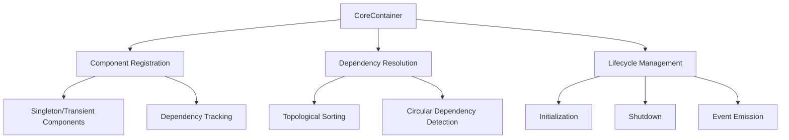
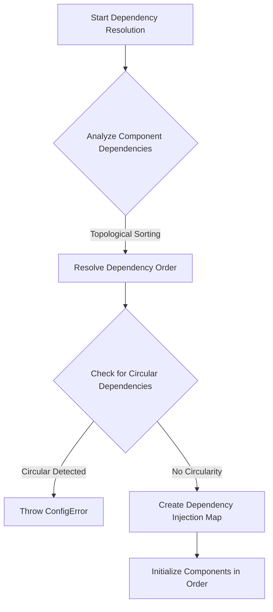

# CoreContainer System Documentation

## Table of Contents
1. [Overview](#overview)
2. [Purpose](#purpose)
3. [System Architecture](#system-architecture)
4. [Core Concepts](#core-concepts)
5. [Installation](#installation)
6. [Usage](#usage)
7. [Advanced Features](#advanced-features)
8. [Best Practices](#best-practices)
9. [Extending the System](#extending-the-system)
10. [Troubleshooting](#troubleshooting)

## Overview

The CoreContainer System is a sophisticated Dependency Injection (DI) and Inversion of Control (IoC) container designed to manage component lifecycles, dependencies, and system initialization.

## Purpose

The primary goals of the CoreContainer System are to:
- Manage component dependencies
- Facilitate loose coupling between system components
- Automate component initialization and shutdown
- Provide a centralized component registry
- Support complex dependency graphs

## System Architecture

### Core Components

1. **CoreContainer** (`src/core/container/Container.js`)
   - Central component management system
   - Handles component registration
   - Manages dependency resolution
   - Controls component lifecycle

### Architecture Diagram



## Core Concepts

### Component Registration

- Components can be registered with optional configuration
- Supports singleton and transient component modes
- Tracks component dependencies

### Dependency Resolution

- Automatically resolves and injects dependencies
- Supports complex dependency graphs
- Prevents circular dependencies
- Ensures correct initialization order

### Lifecycle Management

- Provides `initialize()` and `shutdown()` methods
- Supports component-specific initialization logic
- Graceful shutdown with error handling

## Installation

```bash
npm install @your-org/core-container-system
```

## Usage

### Basic Component Registration

```javascript
import { CoreContainer } from '@your-org/core-container-system';

class LoggerService {
  async initialize() {
    console.log('Logger initialized');
  }
}

class DatabaseService {
  static dependencies = ['logger'];

  constructor(deps) {
    this.logger = deps.logger;
  }

  async initialize() {
    this.logger.log('Connecting to database');
    // Database connection logic
  }

  async shutdown() {
    // Close database connection
  }
}

const container = new CoreContainer();

// Register components
container.register('logger', LoggerService);
container.register('database', DatabaseService);

// Initialize all components
await container.initialize();
```

### Advanced Dependency Injection

```javascript
class AuthService {
  static dependencies = ['database', 'logger'];

  constructor(deps) {
    this.database = deps.database;
    this.logger = deps.logger;
  }

  async authenticate(credentials) {
    this.logger.log('Authentication attempt');
    // Authentication logic
  }
}

container.register('auth', AuthService);
```

### Dependency Resolution

The CoreContainer uses a sophisticated dependency resolution mechanism:

#### Key Resolution Strategies
- Automatically resolves and injects dependencies
- Supports complex dependency graphs
- Prevents circular dependencies
- Ensures correct initialization order

#### Dependency Resolution Algorithm



#### Circular Dependency Prevention

```javascript
resolveDependencyOrder() {
  const visited = new Set();
  const visiting = new Set();
  const order = [];

  const visit = (name) => {
    if (visited.has(name)) return;
    if (visiting.has(name)) {
      throw new ConfigError(
        'CIRCULAR_DEPENDENCY',
        `Circular dependency detected: ${name}`
      );
    }

    visiting.add(name);
    
    const deps = this.dependencies.get(name) || [];
    for (const dep of deps) {
      visit(dep);
    }
    
    visiting.delete(name);
    visited.add(name);
    order.push(name);
  };

  for (const name of this.components.keys()) {
    visit(name);
  }

  return order;
}
```

#### Complex Dependency Example

```javascript
class DatabaseService {
  static dependencies = ['logger', 'configManager'];
  // ...
}

class AuthService {
  static dependencies = ['database', 'logger'];
  // ...
}

class UserService {
  static dependencies = ['database', 'auth'];
  // ...
}

// CoreContainer will resolve in correct order:
// 1. Logger
// 2. ConfigManager
// 3. Database
// 4. Auth
// 5. User Services
```

## Advanced Features

### Event Handling

The CoreContainer emits events during key lifecycle stages:

```javascript
container.on('component:registered', ({ name, Component }) => {
  console.log(`Component ${name} registered`);
});

container.on('initialized', () => {
  console.log('All components initialized');
});
```

### Component Registration Flexibility

The CoreContainer supports multiple component registration styles:

```javascript
// Class Constructor
container.register('service', MyService);

// Factory Function
container.register('service', () => new MyService());

// Existing Instance
container.register('service', myServiceInstance);

// With Singleton/Transient Options
container.register('service', MyService, { 
  singleton: true,  // Default behavior
  singleton: false  // Create new instance each time
});
```

### Dependency Injection Modes

1. **Constructor Injection**
```javascript
class DatabaseService {
  constructor(deps) {
    this.logger = deps.logger;
  }
}
```

2. **Factory Function Injection**
```javascript
const createAuthService = (deps) => {
  return {
    login: () => {
      deps.logger.log('Login attempt');
    }
  };
};
```

### Advanced Resolution Strategies

- Supports multiple component definition styles
- Automatic dependency resolution
- Lazy initialization
- Singleton instance caching
- Dynamic dependency injection


### Dependency Tracking

- Dynamic dependency tracking
- Supports optional and required dependencies
- Provides detailed dependency graphs
- Enables lazy loading of components

## Best Practices

1. Declare component dependencies explicitly
2. Keep components loosely coupled
3. Use dependency injection for better testability
4. Implement `initialize()` and `shutdown()` methods
5. Avoid complex initialization logic

## Extending the System

### Custom Component Lifecycle

```javascript
class CustomComponent {
  async initialize() {
    // Custom initialization
  }

  async shutdown() {
    // Custom cleanup
  }
}
```

## Troubleshooting

### Common Issues

- **Circular Dependencies**: Carefully manage component dependencies
- **Initialization Order**: Ensure correct dependency declaration
- **Error Handling**: Implement robust error handling in component methods

## Limitations

- Does not support dynamic component registration after initialization
- Requires explicit dependency declaration
- Limited to single-instance dependency injection

## Future Roadmap

- [ ] Dynamic component registration
- [ ] Nested container support
- [ ] More advanced dependency resolution
- [ ] Enhanced error handling
- [ ] Performance optimizations

## Contributing

Guidelines for contributing to the CoreContainer System will be added in future versions.

## License

[Your License Information]
