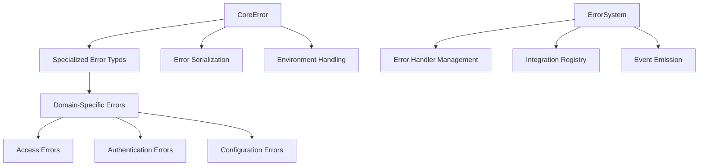

# Error System Documentation

## Table of Contents
1. [Overview](#overview)
2. [Purpose](#purpose)
3. [System Architecture](#system-architecture)
4. [Error Types](#error-types)
5. [Installation](#installation)
6. [Usage](#usage)
7. [Advanced Features](#advanced-features)
8. [Best Practices](#best-practices)
9. [Extending the System](#extending-the-system)
10. [Troubleshooting](#troubleshooting)

## Overview

The Error System is a comprehensive, extensible error handling framework designed to provide robust, consistent error management across the application.

## Purpose

The primary goals of the Error System are to:
- Standardize error representation
- Provide detailed error context
- Enable flexible error handling
- Support comprehensive error logging and tracking
- Facilitate easier debugging and system observability

## System Architecture

### Core Components

1. **CoreError** (`src/core/errors/Error.js`)
   - Base error class for all custom errors
   - Provides advanced error serialization
   - Handles error cause tracking
   - Supports environment-specific error formatting

2. **ErrorSystem** (`src/core/errors/ErrorSystem.js`)
   - Manages error types and integrations
   - Provides dynamic error handler registration
   - Implements event-driven error handling

3. **Error Types** (`src/core/errors/types/`)
   - Specialized error classes for different domains:
     * AccessError
     * AuthError
     * ConfigError
     * ModuleError
     * NetworkError
     * ServiceError
     * ValidationError

### Architecture Diagram



## Error Codes

### Error Code Structure

Error codes are structured to provide clear, hierarchical categorization:

```javascript
ErrorCodes = {
  CORE: {
    UNKNOWN: 'UNKNOWN_ERROR',
    INITIALIZATION: 'INITIALIZATION_FAILED',
    VALIDATION: 'VALIDATION_FAILED'
  },
  MODULE: {
    INITIALIZATION: 'INITIALIZATION_FAILED',
    REGISTRATION: 'REGISTRATION_FAILED',
    DEPENDENCY: 'DEPENDENCY_ERROR'
  },
  // ... other error code categories
}
```

### Using Error Codes

```javascript
import { ErrorCodes, ValidationError } from '@your-org/error-system';

// Using predefined error codes
const validationError = new ValidationError(
  ErrorCodes.VALIDATION.FAILED, 
  'Validation failed',
  { details: 'Specific validation error' }
);
```

## Framework Integration

## Framework Integration

### Fastify Error Handling

The error system provides deep integration with Fastify, automatically handling various error scenarios:

```javascript
// Automatic error mapping
fastify.get('/route', async (request, reply) => {
  // Throws a 404 if route not found
  // Automatically converted to NetworkError
});

// Custom error types are preserved
throw new ValidationError('INVALID_INPUT', 'Validation failed');
```

### Error Mapping Examples

```javascript
// 404 Route Not Found
// Automatically converted to:
NetworkError {
  code: 'NETWORK_ROUTE_NOT_FOUND',
  message: 'Route GET:/test not found',
  statusCode: 404
}

// Validation Error
ValidationError {
  code: 'VALIDATION_FAILED',
  message: 'Invalid input',
  statusCode: 400,
  validationErrors: [...]
}
```

### Error Serialization

- Consistent JSON error format
- Environment-aware error details
- Preserves error context
- Supports custom error types

### Default Error Handling

```javascript
// Fallback error handler always exists
errorSystem.handleError(error, context);
```


## Error Types

### Available Error Types

1. **AccessError**
   - Used for authorization and access control issues
   - Default status code: 403 (Forbidden)

2. **AuthError**
   - Used for authentication-related errors
   - Default status code: 401 (Unauthorized)

3. **ConfigError**
   - Used for configuration and setup errors
   - Default status code: 500 (Internal Server Error)

4. **ModuleError**
   - Used for module system and initialization errors
   - Default status code: 500 (Internal Server Error)

5. **NetworkError**
   - Used for network-related errors
   - Default status code: 503 (Service Unavailable)

6. **ServiceError**
   - Used for service-level errors
   - Default status code: 503 (Service Unavailable)

7. **ValidationError**
   - Used for input validation errors
   - Default status code: 400 (Bad Request)

## Installation

```bash
npm install @your-org/error-system
```

## Usage

### Basic Error Creation

```javascript
import { 
  ValidationError, 
  ErrorCodes 
} from '@your-org/error-system';

// Create a validation error
const validationError = new ValidationError(
  ErrorCodes.VALIDATION.FAILED, 
  'Invalid user input', 
  { 
    validationErrors: [
      { field: 'email', message: 'Invalid email format' }
    ]
  }
);
```

### Error Handling with ErrorSystem

```javascript
import { ErrorSystem } from '@your-org/error-system';

// Create error system
const errorSystem = new ErrorSystem({ logger: customLogger });

// Register a custom error handler
errorSystem.registerHandler('ValidationError', (error, context) => {
  // Custom handling logic
  logger.warn(`Validation failed: ${error.message}`, {
    errors: error.validationErrors,
    context
  });
});

// Handle an error
try {
  // Some operation that might throw an error
} catch (error) {
  await errorSystem.handleError(error);
}
```

## Advanced Features

### Error Cause Tracking

```javascript
const originalError = new Error('Database connection failed');
const wrappedError = new ServiceError(
  'DB_CONNECTION', 
  'Could not connect to database', 
  {}, 
  { cause: originalError }
);
```

### JSON Serialization

```javascript
const error = new ValidationError('INVALID_INPUT', 'Validation failed');
const serializedError = error.toJSON();
// Can be sent over network, logged, etc.
```

## Best Practices

1. Always use specific error types
2. Include detailed context in error details
3. Use error codes for consistent error identification
4. Log errors with sufficient context
5. Handle errors at appropriate levels

## Extending the System

### Creating a Custom Error Type

```javascript
import { CoreError } from '@your-org/error-system';

class CustomDomainError extends CoreError {
  constructor(code, message, details = {}, options = {}) {
    super(`CUSTOM_${code}`, message, details, options);
    this.statusCode = 422; // Custom status code
  }
}
```

## Troubleshooting

### Common Issues

- **Circular Error Handling**: Avoid recursive error handling
- **Over-logging**: Be cautious about logging sensitive information
- **Error Serialization**: Ensure error details are JSON-serializable

## Future Roadmap

- [ ] Enhanced error tracking
- [ ] Distributed tracing support
- [ ] More granular error categorization
- [ ] Performance optimizations

## Contributing

Guidelines for contributing to the Error System will be added in future versions.

## License

[Your License Information]
