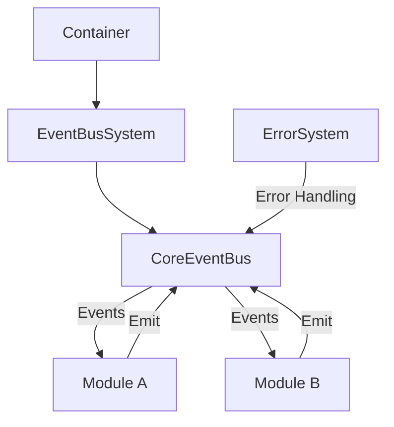

# Event Bus System Documentation

## Table of Contents
1. [Overview](#overview)
2. [Core Components](#core-components)
3. [System Architecture](#system-architecture)
4. [Container Integration](#container-integration)
5. [Lifecycle Management](#lifecycle-management)
6. [Error Handling](#error-handling)
7. [Event Management](#event-management)
8. [Module Integration](#module-integration)
9. [Default Implementations](#default-implementations)
10. [Testing Strategy](#testing-strategy)
11. [Best Practices](#best-practices)
12. [Troubleshooting](#troubleshooting)

## Overview

The EventBus system provides centralized event management and message broker functionality for the TSMIS architecture. It serves as the communication backbone between modules while maintaining system boundaries and proper dependency management.

### Core Dependencies
```javascript
static dependencies = ['errorSystem', 'config'];
```

### Key Features
- Centralized event management
- Module-to-module communication
- Event history tracking
- Message queuing
- Error handling integration
- Health monitoring

## Core Components

### 1. CoreEventBus
Base event handling class providing core event functionality:

```javascript
export class CoreEventBus extends EventEmitter {
  constructor(deps = {}) {
    super();
    this.deps = deps;
    this.queues = new Map();
    this.subscriptions = new Map();
    this.history = new Map();
    this.maxHistorySize = deps.config?.eventHistory?.maxSize || 1000;
    this.initialized = false;
  }

  // Core event handling methods
  async emit(eventName, data, options = {}) {}
  async subscribe(pattern, handler, options = {}) {}
  async queueEvent(event, options = {}) {}
  async processQueue(queueName) {}
}
```

### 2. EventBusSystem
System-level management of the EventBus:

```javascript
export class EventBusSystem extends EventEmitter {
  static dependencies = ['errorSystem', 'config'];

  constructor(deps) {
    super();
    this.deps = deps;
    this.eventBus = null;
    this.initialized = false;
  }

  getEventBus() {
    if (!this.initialized) {
      throw new CoreError('NOT_INITIALIZED', 'EventBusSystem is not initialized');
    }
    return this.eventBus;
  }
}
```

## System Architecture

### Architecture Flow


## Container Integration

### Registration
```javascript
// src/app.js
import { createEventBusSystem } from './core/event/EventBusSystem.js';

// Register with container
container.register('eventBusSystem', createEventBusSystem);

// Registration order
container.register('errorSystem', createErrorSystem);
container.register('config', () => ({}));
container.register('eventBusSystem', createEventBusSystem);
container.register('moduleSystem', createModuleSystem);
```

## Lifecycle Management

### Initialization
```javascript
class EventBusSystem {
  async initialize() {
    if (this.initialized) {
      throw new CoreError('ALREADY_INITIALIZED', 'EventBusSystem is already initialized');
    }

    try {
      // Create and initialize event bus
      this.eventBus = new CoreEventBus(this.deps);
      await this.eventBus.initialize();

      this.initialized = true;
      this.emit('system:initialized', {
        timestamp: new Date().toISOString()
      });
    } catch (error) {
      await this.handleError(error);
      throw error;
    }
  }
}
```

### Shutdown
```javascript
class EventBusSystem {
  async shutdown() {
    if (!this.initialized) return;

    try {
      await this.eventBus.shutdown();
      this.initialized = false;
      this.emit('system:shutdown', {
        timestamp: new Date().toISOString()
      });
    } catch (error) {
      await this.handleError(error, { phase: 'shutdown' });
      throw error;
    }
  }
}
```

## Error Handling

### Integration with ErrorSystem
```javascript
class CoreEventBus {
  async handleError(error, context = {}) {
    if (this.deps.errorSystem) {
      await this.deps.errorSystem.handleError(error, {
        source: 'CoreEventBus',
        ...context
      });
    }
  }
}
```

### Error Propagation
```javascript
async emit(eventName, data, options = {}) {
  try {
    // Event emission logic
  } catch (error) {
    await this.handleError(error, {
      eventName,
      data,
      options
    });
    throw error;
  }
}
```

## Event Management

### Event Structure
```javascript
const event = {
  id: crypto.randomUUID(),
  name: eventName,
  data,
  timestamp: new Date().toISOString(),
  metadata: options.metadata || {}
};
```

### Event Emission
```javascript
async emit(eventName, data, options = {}) {
  const event = this.createEvent(eventName, data, options);
  
  // Store in history
  this.trackEvent(event);

  // Handle queuing if needed
  if (options.queue) {
    return this.queueEvent(event, options);
  }

  // Normal event emission
  return super.emit(eventName, event);
}
```

### Event History
```javascript
trackEvent(event) {
  const history = this.history.get(event.name) || [];
  history.unshift(event);

  if (history.length > this.maxHistorySize) {
    history.pop();
  }

  this.history.set(event.name, history);
}
```

## Module Integration

### Module Access
```javascript
class BusinessModule extends CoreModule {
  constructor(deps) {
    super(deps);
    // Get eventBus from eventBusSystem
    this.eventBus = deps.eventBusSystem.getEventBus();
  }
}
```

### Event Handling in Modules
```javascript
class BusinessModule extends CoreModule {
  async setupEventHandlers() {
    const eventBus = this.deps.eventBusSystem.getEventBus();
    
    // Subscribe to events
    eventBus.subscribe('domain.event', this.handleDomainEvent.bind(this));
    eventBus.subscribe('system.*', this.handleSystemEvents.bind(this));
  }

  async handleDomainEvent(event) {
    try {
      // Handle domain event
    } catch (error) {
      await this.handleError(error, { event });
    }
  }
}
```

## Default Implementations

### Factory Functions
```javascript
// EventBusSystem Factory
export function createEventBusSystem(deps = {}) {
  return new EventBusSystem(deps);
}

// CoreEventBus Factory for Testing/Development
export function createEventBus(deps = {}) {
  const defaultDeps = {
    errorSystem: {
      handleError: async () => {} // No-op error handler
    },
    config: {} // Empty configuration object
  };

  return new CoreEventBus({
    ...defaultDeps,
    ...deps
  });
}
```

### Default Module Integration
```javascript
// In Module Factory
export function createModule(deps = {}) {
  const defaultDeps = {
    errorSystem: {
      handleError: async () => {}
    },
    eventBusSystem: {
      getEventBus: () => new CoreEventBus({
        errorSystem: deps.errorSystem,
        config: deps.config
      })
    },
    config: {}
  };

  return new CoreModule({
    ...defaultDeps,
    ...deps
  });
}
```

## Testing Strategy

### EventBus Testing
```javascript
describe('CoreEventBus', () => {
  let eventBus;
  let mockDeps;

  beforeEach(() => {
    mockDeps = {
      errorSystem: {
        handleError: jest.fn()
      },
      config: {}
    };
    eventBus = new CoreEventBus(mockDeps);
  });

  test('should emit events', async () => {
    const handler = jest.fn();
    eventBus.on('test.event', handler);
    
    await eventBus.emit('test.event', { data: 'test' });
    expect(handler).toHaveBeenCalled();
  });
});
```

### System Testing
```javascript
describe('EventBusSystem', () => {
  let system;
  let mockDeps;

  beforeEach(() => {
    mockDeps = {
      errorSystem: {
        handleError: jest.fn()
      },
      config: {}
    };
    system = new EventBusSystem(mockDeps);
  });

  test('should initialize', async () => {
    await system.initialize();
    expect(system.initialized).toBe(true);
    expect(system.getEventBus()).toBeDefined();
  });
});
```

## Best Practices

1. Event Naming
- Use domain-driven event names: `domain.action`
- Include version for breaking changes: `user.created.v2`
- Be specific and descriptive

2. Event Handling
- Always use try/catch in handlers
- Validate event data
- Keep handlers focused
- Use proper error context

3. Module Integration
- Get eventBus through eventBusSystem
- Setup handlers in setupEventHandlers
- Clean up subscriptions on shutdown
- Use proper error handling

4. Testing
- Use mock dependencies
- Test both success and error cases
- Verify event handling
- Test lifecycle methods

## Troubleshooting

### Common Issues

1. Event Bus Not Initialized
```javascript
// Check initialization
if (!this.initialized) {
  throw new CoreError('NOT_INITIALIZED', 'EventBusSystem is not initialized');
}
```

2. Missing Dependencies
```javascript
// Validate dependencies
const missing = this.constructor.dependencies.filter(
  dep => !this.deps[dep]
);

if (missing.length > 0) {
  throw new ModuleError(
    'MISSING_DEPENDENCIES',
    `Missing required dependencies: ${missing.join(', ')}`
  );
}
```

3. Event Handler Errors
```javascript
try {
  await handler(event);
} catch (error) {
  await this.handleError(error, {
    event,
    handler: handler.name
  });
}
```

### Debugging Tips

1. Enable Debug Logging
```javascript
const eventBus = this.deps.eventBusSystem.getEventBus();
eventBus.on('*', (event) => {
  console.debug('Event:', event);
});
```

2. Check Event History
```javascript
const history = eventBus.getHistory(eventName);
console.log('Event history:', history);
```

3. Monitor Health
```javascript
const health = await eventBus.checkHealth();
console.log('EventBus health:', health);
```
