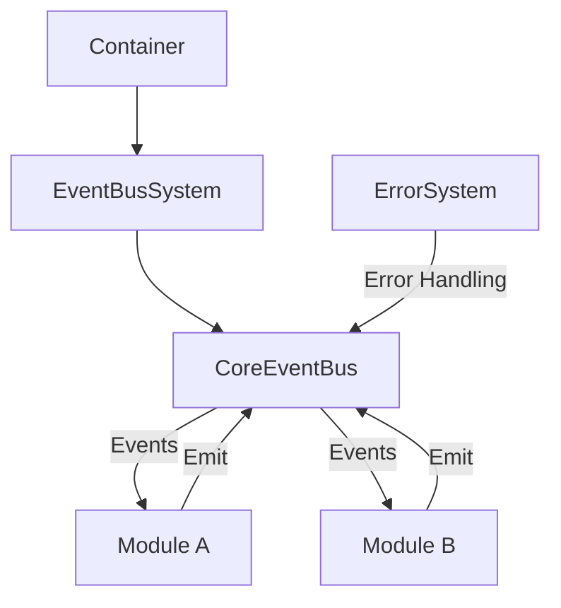

# Event Bus System Documentation

## Table of Contents
1. [Overview](#overview)
2. [Core Concepts](#core-concepts)
3. [System Architecture](#system-architecture)
4. [Core Components](#core-components)
5. [State Management](#state-management)
6. [Error Handling](#error-handling)
7. [Event Management](#event-management)
8. [Health Monitoring](#health-monitoring)
9. [System Lifecycle](#system-lifecycle)
10. [Testing Strategy](#testing-strategy)
11. [Best Practices](#best-practices)
12. [Using EventBus in Modules](#using-eventbus-in-modules)
13. [Troubleshooting](#troubleshooting)

## Overview

The EventBus system provides centralized event management and message broker functionality for the TSMIS architecture. It serves as the communication backbone between modules while maintaining system boundaries and proper dependency management. The EventBus enables loose coupling between modules through an event-driven architecture pattern.

### Core Dependencies
```javascript
static dependencies = ['errorSystem', 'config'];
```

### Key Features
- Centralized event management
- Module-to-module communication
- Event history tracking
- Message queuing
- Pattern-based event subscription
- Error handling integration
- Health monitoring
- Metrics tracking

## Core Concepts

### Event-Driven Communication

The EventBus system implements the publish-subscribe pattern (pub/sub) where:
- Publishers emit events without knowledge of subscribers
- Subscribers listen for events without knowledge of publishers
- Events carry data and metadata
- Communication is asynchronous and decoupled

### Core Dependencies

The EventBus system requires two essential dependencies:

```javascript
static dependencies = ['errorSystem', 'config'];
```

#### Dependency Resolution

Dependencies are resolved through one of these methods:

1. **Container Resolution** (primary method)
   - Dependencies are automatically injected by the Container
   - Container manages lifecycle and dependencies

2. **Default Fallbacks** (development/testing)
   - Default implementations for easier testing and development

3. **Explicit Injection**
   - Manual dependency injection for specialized cases

#### Default Fallbacks

```javascript
const defaultDeps = {
  errorSystem: {
    handleError: async () => {} // No-op handler
  },
  config: {
    eventHistory: {
      maxSize: 1000 // Default event history size
    }
  }
};
```

### Event Structure

Events in the system follow a standardized structure:

```javascript
const event = {
  id: crypto.randomUUID(),      // Unique event identifier
  name: eventName,              // Event name (e.g., 'user.created')
  data: payload,                // Event payload
  timestamp: new Date().toISOString(), // Event creation time
  metadata: options.metadata || {}    // Additional metadata
};
```

### Subscription Types

The EventBus supports several types of subscriptions:

1. **Direct Subscriptions**
   - Exact event name match
   ```javascript
   eventBus.subscribe('user.created', handler);
   ```

2. **Wildcard Subscriptions**
   - Match all events
   ```javascript
   eventBus.subscribe('*', handler);
   ```

3. **Pattern-Based Subscriptions**
   - Match events based on patterns
   ```javascript
   eventBus.subscribe('user.*', handler); // All user events
   eventBus.subscribe('*.created', handler); // All creation events
   ```

### Event Queuing

Events can be queued for delayed processing:

```javascript
// Queue event
await eventBus.emit('user.created', userData, { queue: true });

// Process all queued 'user.created' events
await eventBus.processQueue('user.created');

// Process all queued events
await eventBus.processAllQueues();
```

## System Architecture

### Architecture Flow


### Integration with Other Systems

The EventBus system integrates with:

1. **ErrorSystem**
   - Error handling and forwarding
   - Error context enrichment
   - Error history management

2. **ModuleSystem**
   - Inter-module communication
   - Module lifecycle events
   - Module health monitoring

3. **CoreContainer**
   - Dependency injection
   - Lifecycle management

## Core Components

### CoreEventBus

The CoreEventBus is the fundamental event handling component:

```javascript
export class CoreEventBus extends EventEmitter {
  static dependencies = ['errorSystem', 'config'];
  static version = '1.0.0';

  constructor(deps = {}) {
    super();
    this.deps = deps;
    this.queues = new Map();
    this.subscriptions = new Map();
    this.history = new Map();
    this.maxHistorySize = deps.config?.eventHistory?.maxSize || 1000;
    this.initialized = false;
    this.state = {
      status: 'created',
      startTime: null,
      metrics: new Map(),
      errors: [],
      healthChecks: new Map()
    };
  }

  // Core methods
  async initialize() { /* ... */ }
  async emit(eventName, data, options = {}) { /* ... */ }
  subscribe(pattern, handler, options = {}) { /* ... */ }
  unsubscribe(subscriptionId) { /* ... */ }
  async queueEvent(event, options = {}) { /* ... */ }
  async processQueue(queueName) { /* ... */ }
  async processAllQueues() { /* ... */ }
  async reset() { /* ... */ }
  async shutdown() { /* ... */ }
  
  // Health monitoring
  async checkHealth() { /* ... */ }
  registerHealthCheck(name, checkFn) { /* ... */ }
  
  // History and metrics
  trackEvent(event) { /* ... */ }
  getHistory(eventName, options = {}) { /* ... */ }
  getAllHistory(options = {}) { /* ... */ }
  recordMetric(name, value, tags = {}) { /* ... */ }
}
```

### EventBusSystem

The EventBusSystem manages the CoreEventBus and provides system-level functionality:

```javascript
export class EventBusSystem extends EventEmitter {
  static dependencies = ['errorSystem', 'config'];
  static version = '1.0.0';

  constructor(deps) {
    super();
    this.deps = deps;
    this.eventBus = null;
    this.initialized = false;
    this.state = {
      status: 'created',
      startTime: null,
      metrics: new Map(),
      errors: [],
      healthChecks: new Map()
    };
  }

  // Core methods
  async initialize() { /* ... */ }
  getEventBus() { /* ... */ }
  async shutdown() { /* ... */ }
  
  // Health monitoring
  async checkHealth() { /* ... */ }
  registerHealthCheck(name, checkFn) { /* ... */ }
  
  // Status and metrics
  getStatus() { /* ... */ }
  getMetrics() { /* ... */ }
  recordMetric(name, value, tags = {}) { /* ... */ }
}
```

## State Management

### EventBus States

Both CoreEventBus and EventBusSystem transition through the following states during their lifecycle:

- **created**: Initial state after instantiation
- **initializing**: During initialization process
- **running**: System is active and operational
- **shutting_down**: During shutdown process
- **shutdown**: System is inactive
- **error**: Error state when something fails

### State Tracking

The state object stores comprehensive system metadata:

```javascript
this.state = {
  status: 'created',          // Current system state
  startTime: null,            // When system was started
  errors: [],                 // Error history
  metrics: new Map(),         // Performance metrics
  healthChecks: new Map()     // Health check functions
};
```

### Metrics Tracking

The EventBus system tracks various metrics:

```javascript
// Record a metric
eventBus.recordMetric('events.processed', 42, { 
  eventType: 'user.created',
  source: 'userModule'
});

// Get metrics
const metrics = eventBusSystem.getMetrics();
```

Key metrics include:
- Event emission counts
- Subscription counts
- Queue sizes
- Processing times
- Error counts

## Error Handling

### Error Management

Both CoreEventBus and EventBusSystem include robust error handling:

```javascript
async handleError(error, context = {}) {
  // Add error to state
  this.state.errors.push({
    timestamp: new Date().toISOString(),
    error: error.message,
    context: context || {}
  });
  
  // Trim error history if needed
  if (this.state.errors.length > 100) {
    this.state.errors.shift();
  }
  
  // Record metric
  this.recordMetric('eventbus.errors', 1, {
    errorType: error.constructor.name,
    errorCode: error.code
  });
  
  // Forward to error system if available
  if (this.deps.errorSystem) {
    await this.deps.errorSystem.handleError(error, {
      source: 'CoreEventBus', // or 'EventBusSystem'
      ...context
    });
  }
}
```

### Error Propagation

Errors during event emission are handled gracefully:

```javascript
async emit(eventName, data, options = {}) {
  try {
    // Event emission logic
    // ...
  } catch (error) {
    await this.handleError(error, {
      eventName,
      data,
      options
    });
    throw error;
  }
}
```

### Error Handling in Event Handlers

When implementing event handlers, always use try/catch:

```javascript
eventBus.subscribe('user.created', async (event) => {
  try {
    // Handle event
    await processUser(event.data);
  } catch (error) {
    // Forward to error system
    await module.handleError(error, { 
      event, 
      handler: 'processNewUser' 
    });
  }
});
```

## Event Management

### Event Emission

Events can be emitted with various options:

```javascript
// Basic event emission
await eventBus.emit('user.created', {
  id: 'user-123',
  name: 'John Doe',
  email: 'john@example.com'
});

// Event with metadata
await eventBus.emit('user.created', userData, {
  metadata: {
    source: 'registration-form',
    ip: '192.168.1.1'
  }
});

// Queued event
await eventBus.emit('bulk.process', largeDataset, {
  queue: true
});

// Immediate queue processing
await eventBus.emit('notification.send', notification, {
  queue: true,
  immediate: true
});
```

### Event Subscription

Modules can subscribe to events in several ways:

```javascript
// Direct subscription
const subId = eventBus.subscribe('user.created', handleUserCreated);

// Wildcard subscription (all events)
eventBus.subscribe('*', logAllEvents);

// Pattern subscription (all user events)
eventBus.subscribe('user.*', handleUserEvents);

// Pattern subscription (all creation events)
eventBus.subscribe('*.created', handleCreationEvents);

// Unsubscribe
eventBus.unsubscribe(subId);
```

### Event History

The EventBus maintains a history of emitted events:

```javascript
// Get history for a specific event
const userCreatedEvents = eventBus.getHistory('user.created');

// Limit history results
const recentUserEvents = eventBus.getHistory('user.created', { limit: 10 });

// Get all event history
const allHistory = eventBus.getAllHistory();
```

### Queue Management

Events can be queued and processed in batches:

```javascript
// Process a specific queue
await eventBus.processQueue('email.send');

// Process all queues
await eventBus.processAllQueues();
```

## Health Monitoring

### Health Check Implementation

The EventBus system includes comprehensive health monitoring:

```javascript
// Register a custom health check
eventBus.registerHealthCheck('connection', async () => {
  const connected = await checkConnection();
  return {
    status: connected ? 'healthy' : 'unhealthy',
    details: { connected }
  };
});

// Get health status
const health = await eventBus.checkHealth();
```

### Default Health Checks

CoreEventBus includes these default health checks:

1. **state**: System state check
   - Checks if the system is initialized and running
   - Reports uptime and error count

2. **queues**: Queue health check
   - Reports queue sizes and total queued events
   - Monitors for queue buildup

3. **subscriptions**: Subscription check
   - Reports subscription count and patterns
   - Ensures event handlers are registered

### Health Check Results

Health check results follow a consistent format:

```javascript
{
  name: 'CoreEventBus',
  version: '1.0.0',
  status: 'healthy', // or 'unhealthy', 'error'
  timestamp: '2024-03-27T12:34:56.789Z',
  checks: {
    state: {
      status: 'healthy',
      uptime: 3600000, // ms
      errorCount: 0
    },
    queues: {
      status: 'healthy',
      queueCount: 2,
      totalQueuedEvents: 10,
      queues: {
        'email.send': 8,
        'notification.push': 2
      }
    },
    subscriptions: {
      status: 'healthy',
      count: 5,
      patterns: ['user.created', 'user.updated', 'system.*', '*', 'email.*']
    }
  }
}
```

## System Lifecycle

### Initialization

The EventBusSystem initialization process:

```javascript
async initialize() {
  if (this.initialized) {
    throw new CoreError('ALREADY_INITIALIZED', 'EventBusSystem is already initialized');
  }

  try {
    // Validate dependencies
    this.validateDependencies();
    
    // Update state
    this.state.status = 'initializing';
    this.state.startTime = Date.now();

    // Create and initialize event bus
    this.eventBus = new CoreEventBus(this.deps);
    await this.eventBus.initialize();

    // Forward eventBus events to the system
    this.eventBus.on('system:*', (event) => {
      this.emit(event.name, event);
    });

    this.initialized = true;
    this.state.status = 'running';
    
    // Emit initialization event
    this.emit('system:initialized', {
      timestamp: new Date().toISOString()
    });
    
    // Record metric
    this.recordMetric('eventbussystem.initialized', 1);
    
    return this;
  } catch (error) {
    this.state.status = 'error';
    this.state.errors.push({
      timestamp: new Date().toISOString(),
      error: error.message
    });
    await this.handleError(error);
    throw error;
  }
}
```

### Shutdown

The EventBusSystem shutdown process:

```javascript
async shutdown() {
  if (!this.initialized) return;

  try {
    this.state.status = 'shutting_down';
    
    // Shutdown eventBus
    if (this.eventBus) {
      await this.eventBus.shutdown();
    }
    
    this.initialized = false;
    this.eventBus = null;
    this.state.status = 'shutdown';
    
    // Emit shutdown event
    this.emit('system:shutdown', {
      timestamp: new Date().toISOString()
    });
    
    // Record metric
    this.recordMetric('eventbussystem.shutdown', 1);
    
    return this;
  } catch (error) {
    this.state.status = 'error';
    await this.handleError(error, { phase: 'shutdown' });
    throw error;
  }
}
```

### Container Registration

Register the EventBusSystem with the container in your application:

```javascript
// src/app.js
import { createEventBusSystem } from './core/event/EventBusSystem.js';

// Register with container
container.register('eventBusSystem', createEventBusSystem);

// Registration order
container.register('errorSystem', createErrorSystem);
container.register('config', () => ({}));
container.register('eventBusSystem', createEventBusSystem);
container.register('moduleSystem', createModuleSystem);
```

## Testing Strategy

### EventBus Testing

Example of testing the CoreEventBus:

```javascript
describe('CoreEventBus', () => {
  let eventBus;
  let mockErrorSystem;
  
  beforeEach(() => {
    // Create mock dependencies
    mockErrorSystem = {
      handleError: jest.fn()
    };
    
    // Create EventBus instance
    eventBus = new CoreEventBus({
      errorSystem: mockErrorSystem,
      config: {
        eventHistory: {
          maxSize: 5
        }
      }
    });
  });
  
  afterEach(() => {
    // Clean up
    if (eventBus.initialized) {
      eventBus.shutdown();
    }
  });
  
  test('should emit events', async () => {
    await eventBus.initialize();
    
    const handler = jest.fn();
    eventBus.on('test.event', handler);
    
    await eventBus.emit('test.event', { message: 'Hello' });
    
    expect(handler).toHaveBeenCalled();
    expect(handler.mock.calls[0][0]).toHaveProperty('name', 'test.event');
    expect(handler.mock.calls[0][0]).toHaveProperty('data', { message: 'Hello' });
  });
  
  // More tests...
});
```

### EventBusSystem Testing

Example of testing the EventBusSystem:

```javascript
describe('EventBusSystem', () => {
  let eventBusSystem;
  let mockErrorSystem;
  
  beforeEach(() => {
    mockErrorSystem = {
      handleError: jest.fn()
    };
    
    eventBusSystem = new EventBusSystem({
      errorSystem: mockErrorSystem,
      config: {}
    });
  });
  
  afterEach(async () => {
    if (eventBusSystem.initialized) {
      await eventBusSystem.shutdown();
    }
  });
  
  test('should initialize correctly', async () => {
    await eventBusSystem.initialize();
    
    expect(eventBusSystem.initialized).toBe(true);
    expect(eventBusSystem.state.status).toBe('running');
    expect(eventBusSystem.eventBus).toBeInstanceOf(CoreEventBus);
  });
  
  // More tests...
});
```

### Testing Event Handlers

Example of testing a module's event handlers:

```javascript
describe('UserModule event handlers', () => {
  let userModule;
  let mockEventBus;
  
  beforeEach(() => {
    // Create mock event bus
    mockEventBus = {
      subscribe: jest.fn(),
      emit: jest.fn()
    };
    
    // Create mock event bus system
    const mockEventBusSystem = {
      getEventBus: () => mockEventBus
    };
    
    // Create module with mocked dependencies
    userModule = new UserModule({
      eventBusSystem: mockEventBusSystem,
      // Other dependencies...
    });
  });
  
  test('should handle user.created events', async () => {
    // Extract the handler function
    await userModule.setupEventHandlers();
    const [[eventName, handler]] = mockEventBus.subscribe.mock.calls;
    
    expect(eventName).toBe('user.created');
    
    // Create a mock event
    const mockEvent = {
      id: 'event-123',
      name: 'user.created',
      data: { id: 'user-123', name: 'John Doe' },
      timestamp: new Date().toISOString()
    };
    
    // Call the handler directly
    await handler(mockEvent);
    
    // Assert expected behavior
    // ...
  });
});
```

## Best Practices

### 1. Event Naming

Follow these event naming conventions:

- Use domain-driven event names: `domain.action`
- Include version for breaking changes: `user.created.v2`
- Use past tense for state changes: `user.created`, `order.completed`
- Use present tense for commands: `notification.send`, `email.process`
- Be specific and descriptive

Examples:
```javascript
// Good
eventBus.emit('user.registered', userData);
eventBus.emit('order.completed', orderData);
eventBus.emit('payment.failed', paymentError);

// Bad - too generic
eventBus.emit('created', userData);
eventBus.emit('process', orderData);
```

### 2. Event Data Structure

Follow these guidelines for event data:

- Keep event data serializable (JSON-compatible)
- Include all necessary context in the data
- Avoid circular references
- Use consistent data structures for similar events
- Don't include sensitive information

Example:
```javascript
// Good
await eventBus.emit('user.created', {
  id: 'user-123',
  name: 'John Doe',
  email: 'john@example.com',
  createdAt: new Date().toISOString(),
  roles: ['user'],
  settings: {
    notifications: true,
    theme: 'dark'
  }
});

// Bad - includes DB model, sensitive data
await eventBus.emit('user.created', userDbModel);
```

### 3. Event Handling

Implement robust event handlers:

- Always use try/catch in handlers
- Validate event data before processing
- Keep handlers focused on a single responsibility
- Use proper error context
- Make handlers idempotent when possible

Example:
```javascript
eventBus.subscribe('order.created', async (event) => {
  try {
    // Validate event data
    if (!event.data || !event.data.id) {
      throw new ValidationError('INVALID_ORDER_DATA', 'Order data is missing required fields');
    }
    
    // Process event
    await processOrder(event.data);
    
    // Record metric
    this.recordMetric('orders.processed', 1, {
      orderId: event.data.id
    });
  } catch (error) {
    // Handle error
    await this.handleError(error, {
      event,
      handler: 'processOrderCreated'
    });
  }
});
```

### 4. Subscription Management

Manage subscriptions properly:

- Set up handlers in module initialization
- Clean up subscriptions on shutdown
- Store subscription IDs for later cleanup
- Use appropriate pattern matching
- Avoid wildcard subscriptions for performance-critical code

Example:
```javascript
class OrderModule extends CoreModule {
  constructor(deps) {
    super(deps);
    this.subscriptions = [];
  }
  
  async setupEventHandlers() {
    const eventBus = this.deps.eventBusSystem.getEventBus();
    
    // Store subscription IDs
    this.subscriptions.push(
      eventBus.subscribe('order.created', this.handleOrderCreated.bind(this)),
      eventBus.subscribe('payment.completed', this.handlePaymentCompleted.bind(this)),
      eventBus.subscribe('shipping.status.*', this.handleShippingUpdates.bind(this))
    );
  }
  
  async onShutdown() {
    // Clean up subscriptions
    const eventBus = this.deps.eventBusSystem.getEventBus();
    for (const subId of this.subscriptions) {
      eventBus.unsubscribe(subId);
    }
    this.subscriptions = [];
  }
}
```

## Using EventBus in Modules

### Module Access to EventBus

Modules should access the EventBus through the EventBusSystem:

```javascript
class BusinessModule extends CoreModule {
  constructor(deps) {
    super(deps);
    // Get eventBus from eventBusSystem
    this.eventBus = deps.eventBusSystem.getEventBus();
  }
}
```

### Setting Up Event Handlers

Implement the `setupEventHandlers` method to set up event handlers:

```javascript
class UserModule extends CoreModule {
  async setupEventHandlers() {
    // Get eventBus from eventBusSystem
    const eventBus = this.deps.eventBusSystem.getEventBus();
    
    // Store subscription IDs for cleanup
    this.subscriptions = [
      // Handle user events
      eventBus.subscribe('user.created', this.handleUserCreated.bind(this)),
      eventBus.subscribe('user.updated', this.handleUserUpdated.bind(this)),
      eventBus.subscribe('user.deleted', this.handleUserDeleted.bind(this)),
      
      // Handle related events
      eventBus.subscribe('auth.login', this.handleUserLogin.bind(this)),
      eventBus.subscribe('auth.logout', this.handleUserLogout.bind(this))
    ];
  }
  
  // Event handlers
  async handleUserCreated(event) {
    try {
      const userData = event.data;
      // Process the user creation...
      await this.db.createUserProfile(userData);
      
      // Emit consequent events
      await this.eventBus.emit('profile.created', {
        userId: userData.id,
        profile: { /* profile data */ }
      });
    } catch (error) {
      await this.handleError(error, {
        event,
        handler: 'handleUserCreated'
      });
    }
  }
  
  // More handlers...
}
```

### Cleaning Up Subscriptions

Clean up subscriptions in the `onShutdown` method:

```javascript
class UserModule extends CoreModule {
  // Other methods...
  
  async onShutdown() {
    // Clean up subscriptions
    if (this.eventBus) {
      for (const subId of this.subscriptions) {
        this.eventBus.unsubscribe(subId);
      }
    }
    this.subscriptions = [];
  }
}
```

### Complete Module Example

A complete example of a module using the EventBus:

```javascript
import { CoreModule } from '../core/module/Module.js';
import { ValidationError } from '../core/errors/index.js';

export class UserModule extends CoreModule {
  static dependencies = ['errorSystem', 'eventBusSystem', 'config', 'database'];
  static version = '1.0.0';
  
  constructor(deps) {
    super(deps);
    this.db = deps.database;
    this.subscriptions = [];
    this.userCache = new Map();
  }
  
  async onConfigure() {
    // Initialize cache settings
    this.cacheEnabled = this.config.userCache?.enabled || true;
    this.cacheTTL = this.config.userCache?.ttl || 3600000; // 1 hour
  }
  
  async setupEventHandlers() {
    const eventBus = this.deps.eventBusSystem.getEventBus();
    
    this.subscriptions = [
      eventBus.subscribe('user.created', this.handleUserCreated.bind(this)),
      eventBus.subscribe('user.updated', this.handleUserUpdated.bind(this)),
      eventBus.subscribe('user.deleted', this.handleUserDeleted.bind(this)),
      eventBus.subscribe('cache.clear', this.handleCacheClear.bind(this))
    ];
  }
  
  async onSetupHealthChecks() {
    // Register user cache health check
    this.registerHealthCheck('userCache', async () => {
      return {
        status: 'healthy',
        size: this.userCache.size,
        enabled: this.cacheEnabled
      };
    });
  }
  
  // Business methods
  async createUser(userData) {
    try {
      // Validate user data
      if (!userData.email) {
        throw new ValidationError('MISSING_EMAIL', 'Email is required');
      }
      
      // Create user in database
      const user = await this.db.users.create(userData);
      
      // Update cache
      if (this.cacheEnabled) {
        this.userCache.set(user.id, {
          data: user,
          expires: Date.now() + this.cacheTTL
        });
      }
      
      // Emit event
      await this.eventBus.emit('user.created', user);
      
      // Record metric
      this.recordMetric('users.created', 1);
      
      return user;
    } catch (error) {
      await this.handleError(error, {
        method: 'createUser',
        userData
      });
      throw error;
    }
  }
  
  // Event handlers
  async handleUserCreated(event) {
    try {
      const user = event.data;
      
      // Update cache if event came from another instance
      if (this.cacheEnabled && event.metadata?.source !== this.instanceId) {
        this.userCache.set(user.id, {
          data: user,
          expires: Date.now() + this.cacheTTL
        });
      }
      
      // Perform additional processing
      await this.sendWelcomeEmail(user);
    } catch (error) {
      await this.handleError(error, {
        event,
        handler: 'handleUserCreated'
      });
    }
  }
  
  async handleUserUpdated(event) {
    try {
      const user = event.data;
      
      // Update cache
      if (this.cacheEnabled) {
        this.userCache.set(user.id, {
          data: user,
          expires: Date.now() + this.cacheTTL
        });
      }
    } catch (error) {
      await this.handleError(error, {
        event,
        handler: 'handleUserUpdated'
      });
    }
  }
  
  async handleUserDeleted(event) {
    try {
      const { userId } = event.data;
      
      // Remove from cache
      if (this.cacheEnabled) {
        this.userCache.delete(userId);
      }
    } catch (error) {
      await this.handleError(error, {
        event,
        handler: 'handleUserDeleted'
      });
    }
  }
  
  async handleCacheClear(event) {
    try {
      if (event.data.target === 'all' || event.data.target === 'users') {
        this.userCache.clear();
        this.recordMetric('cache.cleared', 1, { target: 'users' });
      }
    } catch (error) {
      await this.handleError(error, {
        event,
        handler: 'handleCacheClear'
      });
    }
  }
  
  async onShutdown() {
    // Clean up subscriptions
    if (this.eventBus) {
      for (const subId of this.subscriptions) {
        this.eventBus.unsubscribe(subId);
      }
    }
    
    // Clear cache
    this.userCache.clear();
  }
}
```

## Troubleshooting

### Common Issues

1. **Event Bus Not Initialized**
   - **Symptom**: `NOT_INITIALIZED` error when trying to get or use EventBus
   - **Solution**: Ensure EventBusSystem is initialized before use
   ```javascript
   // Check initialization
   if (!this.initialized) {
     throw new CoreError('NOT_INITIALIZED', 'EventBusSystem is not initialized');
   }
   ```

2. **Missing Dependencies**
   - **Symptom**: `MISSING_DEPENDENCIES` error during initialization
   - **Solution**: Ensure all required dependencies are provided
   ```javascript
   // Validate dependencies
   const missing = this.constructor.dependencies.filter(
     dep => !this.deps[dep]
   );

   if (missing.length > 0) {
     throw new CoreError(
       'MISSING_DEPENDENCIES',
       `Missing required dependencies: ${missing.join(', ')}`
     );
   }
   ```

3. **Event Handler Errors**
   - **Symptom**: Unhandled errors in event handlers
   - **Solution**: Always use try/catch in handlers
   ```javascript
   try {
     await handler(event);
   } catch (error) {
     await this.handleError(error, {
       event,
       handler: handler.name
     });
   }
   ```

4. **Events Not Received**
   - **Symptom**: Event handlers not being triggered
   - **Solution**: Check event names, patterns, and subscription setup
   ```javascript
   // Debug event subscriptions
   console.log('Subscriptions:', Array.from(eventBus.subscriptions.values()));
   
   // Add debug listener
   eventBus.subscribe('*', (event) => {
     console.log('Event received:', event.name, event);
   });
   ```

5. **Memory Leaks**
   - **Symptom**: Increasing memory usage over time
   - **Solution**: Ensure proper cleanup of subscriptions and event history
   ```javascript
   // Clean up subscriptions
   for (const subId of this.subscriptions) {
     eventBus.unsubscribe(subId);
   }
   
   // Limit event history size
   if (history.length > this.maxHistorySize) {
     history.pop(); // Remove oldest events
   }
   ```

### Debugging Techniques

1. **Enable Event Logging**
   ```javascript
   // Add a global event listener
   eventBus.subscribe('*', (event) => {
     console.log(`[${new Date().toISOString()}] Event:`, event.name, event);
   });
   ```

2. **Check Event History**
   ```javascript
   // Check history for a specific event
   const history = eventBus.getHistory('user.created');
   console.log('Event history:', history);
   
   // Check all event history
   const allHistory = eventBus.getAllHistory();
   console.log('All event history:', allHistory);
   ```

3. **Monitor Health**
   ```javascript
   // Check health status
   const health = await eventBus.checkHealth();
   console.log('EventBus health:', JSON.stringify(health, null, 2));
   ```

4. **Inspect Subscriptions**
   ```javascript
   // Log all subscriptions
   const subscriptions = Array.from(eventBus.subscriptions.values());
   console.log('Active subscriptions:', subscriptions);
   ```

5. **Check Queues**
   ```javascript
   // Check queue sizes
   const queueSizes = {};
   for (const [name, queue] of eventBus.queues.entries()) {
     queueSizes[name] = queue.length;
   }
   console.log('Queue sizes:', queueSizes);
   ```

### Common Error Codes

- `NOT_INITIALIZED`: EventBus or EventBusSystem is not initialized
- `ALREADY_INITIALIZED`: EventBus or EventBusSystem is already initialized
- `MISSING_DEPENDENCIES`: Required dependencies are missing
- `INVALID_HEALTH_CHECK`: Invalid health check function
- `INVALID_ERROR_SYSTEM`: ErrorSystem is missing required methods
- `SHUTDOWN_FAILED`: Failed to shutdown EventBus or EventBusSystem

### Performance Tuning

1. **Optimize Event Handlers**
   - Keep handlers focused and efficient
   - Avoid blocking operations
   - Consider using queues for heavy processing

2. **Limit Event History**
   - Set appropriate history size limits
   - Consider disabling history for high-frequency events

3. **Use Specific Subscriptions**
   - Avoid wildcard subscriptions for high-frequency events
   - Use direct subscriptions when possible

4. **Process Queues Efficiently**
   - Schedule queue processing at appropriate intervals
   - Monitor queue sizes and adjust processing frequency