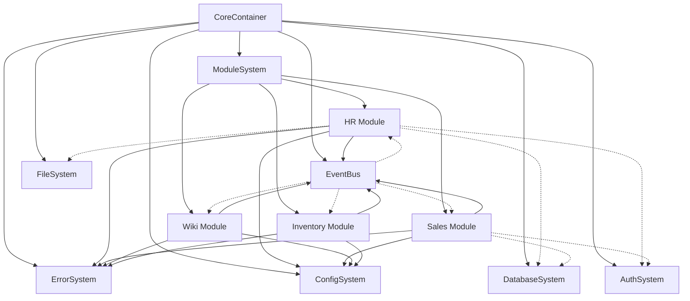
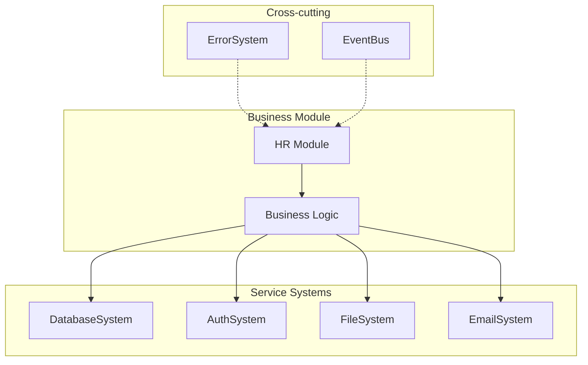

# Module System Documentation

## Table of Contents
1. [Overview](#overview)
2. [Core Concepts](#core-concepts)
3. [System Architecture](#system-architecture)
4. [Core Systems](#core-systems)
5. [Service Systems](#service-systems)
6. [Business Modules](#business-modules)
7. [Integration Patterns](#integration-patterns)
8. [Lifecycle Management](#lifecycle-management)
9. [Error Handling](#error-handling)
10. [Event System](#event-system)
11. [Testing Strategy](#testing-strategy)
12. [Best Practices](#best-practices)
13. [Troubleshooting](#troubleshooting)

## Overview

The TSMIS architecture is built on three main layers:
1. Core Systems - Fundamental infrastructure 
2. Service Systems - Common service functionality
3. Business Modules - Business domain logic

## Core Concepts

### Architectural Principles
- Clear separation of concerns
- Infrastructure/business logic separation
- Domain-driven design
- Event-driven communication
- Dependency injection

### Key Features
- Containerized core systems
- Service encapsulation
- Business domain isolation
- Cross-cutting concerns management
- Health monitoring

## System Architecture



### Detailed Service Integration



## Core Systems

### ModuleSystem
```javascript
// Module registration
await moduleSystem.register('hrModule', HRModule, {
  config: moduleConfig
});

// Module discovery
await moduleSystem.discover('./modules');
```

### ErrorSystem
```javascript
// Error handling in modules
try {
  await this.processEmployee(data);
} catch (error) {
  await this.deps.errorSystem.handleError(error, {
    module: 'hrModule',
    operation: 'processEmployee',
    data
  });
}
```

### EventBus
```javascript
// Event broadcasting
await this.deps.eventBus.emit('employee:created', {
  id: employee.id,
  department: employee.department
});
```

## Service Systems

### DatabaseSystem
```javascript
class DatabaseSystem {
  async query(sql, params) {
    // Database operations
  }
  
  async transaction(callback) {
    // Transaction handling
  }
}
```

### AuthSystem
```javascript
class AuthSystem {
  async authenticate(credentials) {
    // Authentication logic
  }
  
  async authorize(user, resource, action) {
    // Authorization logic
  }
}
```

### FileSystem
```javascript
class FileSystem {
  async store(path, content, metadata) {
    // File operations
  }
  
  async retrieve(path) {
    // File retrieval
  }
}
```

## Business Modules

### Business Module File Structure

A typical business module follows this file structure:

```
modules/accounting/
├── index.js         # Module definition & setup
├── config.js        # Module config
├── errors/          # Module specific errors
├── services/        # Business logic 
├── routes/          # API routes
├── plugins/         # Special tools or features to the specific module
└── schemas/         # Validation schemas
```

- `index.js`: Contains the module class definition and setup code.
- `config.js`: Holds the module-specific configuration.
- `errors/`: Contains module-specific error classes.
- `services/`: Encapsulates the business logic and interactions with other services.
- `routes/`: Defines the API routes handled by the module.
- `plugins/`: Contains special tools or features specific to the module.
- `schemas/`: Holds validation schemas for the module's data.

### Module Implementation
```javascript
class HRModule extends CoreModule {
  static dependencies = ['database', 'auth', 'file', 'email'];

  async processEmployee(data) {
    // Use service systems through dependencies
    await this.deps.database.transaction(async (tx) => {
      await this.deps.auth.authorize('employee.create');
      const employee = await tx.createEmployee(data);
      await this.deps.file.store(`employees/${employee.id}`, data.documents);
      await this.deps.email.send('welcome', employee.email);
    });
  }
}
```

### Module Configuration
```javascript
{
  "modules": {
    "hrModule": {
      "enabled": true,
      "config": {
        "employeeDefaults": {
          "department": "unassigned",
          "status": "pending"
        },
        "documentTypes": ["id", "contract", "certificates"]
      }
    }
  }
}
```

## Integration Patterns

### Service Integration
```javascript
class SalesModule extends CoreModule {
  async createOrder(orderData) {
    // Database integration
    const order = await this.deps.database.query(
      'INSERT INTO orders...'
    );

    // File storage integration
    await this.deps.file.store(
      `orders/${order.id}`, 
      orderData.documents
    );

    // Email integration
    await this.deps.email.send(
      'order-confirmation',
      order.customerEmail
    );

    // Event emission
    await this.deps.eventBus.emit('order:created', order);
  }
}
```

### Cross-module Communication
```javascript
// Inventory module listening to Sales events
class InventoryModule extends CoreModule {
  getEventHandlers() {
    return {
      'order:created': this.updateStock.bind(this)
    };
  }

  async updateStock(orderEvent) {
    await this.deps.database.transaction(async (tx) => {
      // Update inventory
    });
  }
}
```

## Lifecycle Management

### Module Lifecycle
```javascript
class WikiModule extends CoreModule {
  async initialize() {
    // Setup database tables
    await this.deps.database.query(`
      CREATE TABLE IF NOT EXISTS wiki_pages...
    `);

    // Initialize search index
    await this.initializeSearch();
  }

  async shutdown() {
    // Cleanup resources
    await this.cleanupTempFiles();
  }
}
```

## Testing Strategy

### Unit Testing
```javascript
describe('HR Module', () => {
  let hrModule;
  let mockDeps;

  beforeEach(() => {
    mockDeps = {
      database: createMockDatabase(),
      auth: createMockAuth(),
      file: createMockFileSystem(),
      email: createMockEmailSystem()
    };
    hrModule = new HRModule(mockDeps);
  });

  test('should process employee', async () => {
    await hrModule.processEmployee(employeeData);
    expect(mockDeps.database.query).toHaveBeenCalled();
  });
});
```

### Integration Testing
```javascript
describe('Module Integration', () => {
  let container;

  beforeAll(async () => {
    container = new CoreContainer();
    
    // Register systems
    container.register('database', createDatabaseSystem);
    container.register('moduleSystem', createModuleSystem);
    
    await container.initialize();
  });

  test('should handle complete business flow', async () => {
    const hrModule = await container.resolve('hrModule');
    await hrModule.processEmployee(testData);
    // Verify results
  });
});
```

## Best Practices

### 1. Module Implementation
- Focus on business logic
- Use service systems for infrastructure
- Handle errors appropriately
- Emit relevant events
- Implement health checks

### 2. Service Usage
- Access through dependencies
- Use transactions where needed
- Handle service errors
- Monitor service health

### 3. Testing
- Mock service dependencies
- Test business logic
- Verify service integration
- Test error scenarios
- Check event handling

## Troubleshooting

### Common Issues
1. Service Dependencies
   - Check service availability
   - Verify service configuration
   - Monitor service health

2. Business Logic
   - Debug module initialization
   - Check business rules
   - Verify data flow

3. Integration Issues
   - Check service connectivity
   - Verify event flow
   - Debug cross-module communication