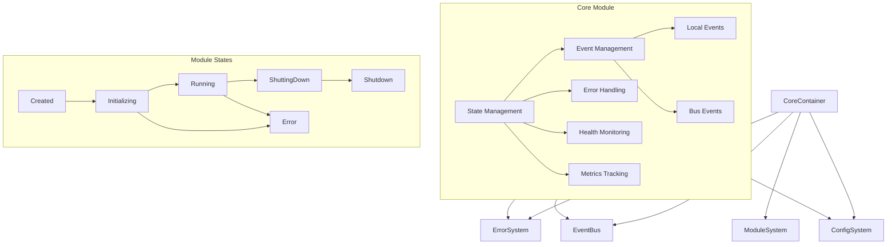

# Module System Documentation

## Table of Contents
1. [Overview](#overview)
2. [Core Concepts](#core-concepts)
3. [System Architecture](#system-architecture)
4. [Core Systems](#core-systems)
5. [Service Systems](#service-systems)
6. [Business Modules](#business-modules)
7. [Integration Patterns](#integration-patterns)
8. [State Management](#state-management)
9. [Error Handling](#error-handling)
10. [Event System](#event-system)
11. [Health Monitoring](#health-monitoring)
12. [Testing Strategy](#testing-strategy)
13. [Best Practices](#best-practices)
14. [Troubleshooting](#troubleshooting)

## Overview

The TSMIS architecture is built on three main layers:
1. Core Systems - Fundamental infrastructure (Container, ErrorSystem, ModuleSystem)
2. Service Systems - Common service functionality
3. Business Modules - Business domain logic

## Core Concepts

### Architectural Principles
- Clear separation of concerns
- Infrastructure/business logic separation
- Event-driven communication
- Dependency injection
- State management

### Key Features
- Core dependencies management
- Module lifecycle control
- Standardized error handling
- Dual event emission (local + bus)
- Health monitoring
- Metrics tracking

## System Architecture



## Core Systems

### ModuleSystem
```javascript
class ModuleSystem extends EventEmitter {
  static dependencies = ['errorSystem', 'eventBus'];

  async register(name, Module, config = {}) {
    // Module registration logic
  }

  async resolve(name) {
    // Module resolution logic
  }
}
```

### CoreModule Base Class
```javascript
class CoreModule extends EventEmitter {
  static dependencies = ['errorSystem', 'eventBus', 'config'];
  static version = '1.0.0';

  constructor(deps = {}) {
    super();
    this.deps = deps;
    this.initialized = false;
    this.config = deps.config || {};
    this.state = {
      status: 'created',
      startTime: null,
      errors: [],
      metrics: new Map()
    };
  }
}
```

## State Management

### Module States
- created: Initial module state
- initializing: During initialization process
- running: Module is active
- shutting_down: During shutdown process
- shutdown: Module is inactive
- error: Error state

### State Tracking
```javascript
this.state = {
  status: 'created',
  startTime: null,
  errors: [],
  metrics: new Map()
};
```

## Error Handling

### Error Management
```javascript
async handleError(error, context = {}) {
  const safeContext = context || {};

  this.state.errors.push({
    timestamp: new Date().toISOString(),
    error: error.message,
    context: safeContext
  });

  if (this.state.errors.length > 100) {
    this.state.errors.shift();
  }

  if (this.deps.errorSystem) {
    await this.deps.errorSystem.handleError(error, {
      module: this.constructor.name,
      ...safeContext
    });
  }
}
```

## Event System

### Dual Event Emission
```javascript
async emit(eventName, ...args) {
  // Local EventEmitter emission
  const localEmitResult = super.emit(eventName, ...args);
  
  // EventBus broadcast
  if (this.deps.eventBus?.emit) {
    await this.deps.eventBus.emit(eventName, ...args);
  }
  
  return localEmitResult;
}
```

## Health Monitoring

### Health Check Implementation
```javascript
async getHealth() {
  return {
    name: this.constructor.name,
    version: this.constructor.version,
    status: this.state.status,
    uptime: this.state.startTime ? Date.now() - this.state.startTime : 0,
    initialized: this.initialized,
    errorCount: this.state.errors.length,
    lastError: this.state.errors[this.state.errors.length - 1],
    metrics: Object.fromEntries(this.state.metrics)
  };
}
```

### Metrics Recording
```javascript
recordMetric(name, value) {
  this.state.metrics.set(name, {
    value,
    timestamp: Date.now()
  });
}
```

## Module Lifecycle

### Initialization
```javascript
async initialize() {
  if (this.initialized) {
    throw new ModuleError('ALREADY_INITIALIZED', 'Module is already initialized');
  }

  try {
    this.state.startTime = Date.now();
    this.state.status = 'initializing';

    await this.onConfigure();
    await this.setupEventHandlers();
    await this.onInitialize();
    
    this.initialized = true;
    this.state.status = 'running';
  } catch (error) {
    this.state.status = 'error';
    throw new ModuleError('INITIALIZATION_FAILED', 'Failed to initialize module',
      { originalError: error }
    );
  }
}
```

### Shutdown
```javascript
async shutdown() {
  if (!this.initialized) return;

  try {
    this.state.status = 'shutting_down';
    await this.onShutdown();
    
    this.initialized = false;
    this.state.status = 'shutdown';
    this.state.startTime = null;
  } catch (error) {
    this.state.status = 'error';
    throw new ModuleError('SHUTDOWN_FAILED', 'Failed to shutdown module',
      { originalError: error }
    );
  }
}
```

## Testing Strategy

### Module Testing
```javascript
describe('CoreModule', () => {
  let module;
  let mockDeps;

  beforeEach(() => {
    mockDeps = {
      errorSystem: {
        handleError: jest.fn()
      },
      eventBus: {
        emit: jest.fn()
      },
      config: {}
    };
    module = new CoreModule(mockDeps);
  });

  test('should handle initialization', async () => {
    await module.initialize();
    expect(module.initialized).toBe(true);
    expect(module.state.status).toBe('running');
  });
});
```

## Best Practices

### 1. Module Implementation
- Validate dependencies in constructor
- Implement lifecycle hooks (onConfigure, onInitialize, onShutdown)
- Handle errors through errorSystem
- Record meaningful metrics
- Maintain clean state transitions

### 2. Error Handling
- Use ModuleError for module-specific errors
- Provide meaningful error contexts
- Limit error history to prevent memory issues
- Forward errors to errorSystem when available

### 3. Event Handling
- Use setupEventHandlers for event subscription
- Leverage dual event emission appropriately
- Handle event errors properly

### 4. Health Monitoring
- Implement meaningful health checks
- Record relevant metrics
- Maintain accurate state information
- Track error history

## Troubleshooting

### Common Issues
1. Initialization Failures
   - Check dependency validation
   - Verify configuration
   - Review initialization hooks

2. State Management
   - Verify state transitions
   - Check metric recording
   - Monitor error history

3. Event Handling
   - Debug local event emission
   - Verify eventBus connectivity
   - Check event handler registration