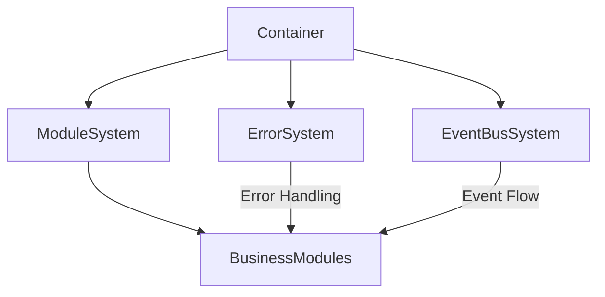

# Module System Documentation

## Table of Contents
1. [Overview](#overview)
2. [Core Concepts](#core-concepts)
3. [System Architecture](#system-architecture)
4. [Core Systems](#core-systems)
5. [Service Systems](#service-systems)
6. [Business Modules](#business-modules)
7. [Integration Patterns](#integration-patterns)
8. [State Management](#state-management)
9. [Error Handling](#error-handling)
10. [Event System](#event-system)
11. [Health Monitoring](#health-monitoring)
12. [Testing Strategy](#testing-strategy)
13. [Best Practices](#best-practices)
14. [Creating Custom Modules](#creating-custom-modules)
15. [Troubleshooting](#troubleshooting)

## Overview

The TSMIS architecture is built on three main layers:
1. **Core Systems** - Fundamental infrastructure (Container, ErrorSystem, EventBusSystem, ModuleSystem)
2. **Service Systems** - Common service functionality
3. **Business Modules** - Business domain logic

The Module System provides a standardized approach to creating, managing, and connecting application components. It enforces consistent module lifecycle management, dependency injection, health monitoring, event communication, and error handling.

## Core Concepts

### Core Dependencies

The module system requires three essential dependencies:

```javascript
static dependencies = ['errorSystem', 'eventBusSystem', 'config'];
```

#### Dependency Resolution

Dependencies are resolved through one of these methods:

1. **Container Resolution** (primary method)
   - Dependencies are automatically injected by the Container
   - Container manages lifecycle and dependencies

2. **Default Fallbacks** (development/testing)
   - Default implementations for easier testing and development

3. **Explicit Injection**
   - Manual dependency injection for specialized cases

#### Default Fallbacks

```javascript
const defaultDeps = {
  errorSystem: {
    handleError: async () => {} // No-op handler
  },
  eventBusSystem: {
    getEventBus: () => new CoreEventBus({ // Use CoreEventBus 
      errorSystem: deps.errorSystem,
      config: deps.config
    })
  },
  config: {} // Empty config
};
```

#### Component Registration

Components can be registered in two ways:

1. **As Singleton Instances:**

```javascript
// In app.js
const eventBusSystem = createEventBusSystem();
container.register('eventBusSystem', () => eventBusSystem);
```

2. **As Factory Functions:**

```javascript
container.register('moduleSystem', (deps) => {
  return createModuleSystem(deps);
});
```

#### Event System Integration

Modules communicate through the EventBus in two ways:

1. **Direct Events (local):**

```javascript
// Within a module
this.emit('localEvent', data);
```

2. **System Events (global):**

```javascript
// Broadcast to all modules
this.eventBus.emit('globalEvent', data);
```

### Architectural Principles
- Clear separation of concerns
- Infrastructure/business logic separation
- Event-driven communication
- Dependency injection
- State management
- Health monitoring

### Key Features
- Core dependencies management
- Module lifecycle control
- Standardized error handling
- Dual event emission (local + bus)
- Health monitoring with automatic checks
- Metrics tracking
- Graceful initialization and shutdown

## System Architecture



## Core Systems

### ModuleSystem
The ModuleSystem manages the registration, initialization, and lifecycle of all modules:

```javascript
class ModuleSystem extends EventEmitter {
  static dependencies = ['errorSystem', 'eventBusSystem', 'config'];

  async register(name, ModuleClass, config = {}) {
    // Module registration logic
    const module = new ModuleClass({
      ...this.deps,
      config: {
        ...this.deps.config?.[name],
        ...config
      }
    });
    this.modules.set(name, module);
    return module;
  }

  async resolve(name) {
    // Module resolution logic
    const module = this.modules.get(name);
    if (!module) {
      throw new ModuleError(
        'MODULE_NOT_FOUND',
        `Module ${name} is not registered`
      );
    }
    return module;
  }
  
  async initialize() {
    // Initialize modules in dependency order
    const initOrder = this.resolveDependencyOrder();
    
    for (const name of initOrder) {
      const module = this.modules.get(name);
      await module.initialize();
      
      // Start monitoring module health
      await this.startModuleHealthMonitoring(name);
    }
  }
  
  async shutdown() {
    // Shutdown modules in reverse dependency order
    const shutdownOrder = this.resolveDependencyOrder().reverse();

    for (const name of shutdownOrder) {
      const module = this.modules.get(name);
      await module.shutdown();
    }
  }
}
```

### CoreModule Base Class
The `CoreModule` serves as the base class for all modules in the system:

```javascript
class CoreModule extends EventEmitter {
  static dependencies = ['errorSystem', 'eventBusSystem', 'config'];
  static version = '1.0.0';

  constructor(deps = {}) {
    super();
    this.deps = deps;
    // Get the eventBus from eventBusSystem
    this.eventBus = deps.eventBusSystem?.getEventBus();
    this.initialized = false;
    this.config = deps.config || {};
    
    // Enhanced state tracking
    this.state = {
      status: 'created',
      startTime: null,
      errors: [],
      metrics: new Map(),
      healthChecks: new Map(),
      lastHealthCheck: null
    };

    // Validate dependencies immediately
    this.validateDependencies();
  }
  
  // Lifecycle hooks for derived classes
  async validateConfig() {/* ... */}
  async onValidateConfig() {/* ... */}
  async initialize() {/* ... */}
  async onConfigure() {/* ... */}
  async setupEventHandlers() {/* ... */}
  async setupHealthChecks() {/* ... */}
  async onSetupHealthChecks() {/* ... */}
  async onInitialize() {/* ... */}
  async shutdown() {/* ... */}
  async onShutdown() {/* ... */}
}
```

## State Management

### Module States
Modules transition through the following states during their lifecycle:

- **created**: Initial module state after instantiation
- **initializing**: During initialization process
- **running**: Module is active and operational
- **shutting_down**: During shutdown process
- **shutdown**: Module is inactive
- **error**: Error state when something fails

### State Tracking
The state object stores comprehensive module metadata:

```javascript
this.state = {
  status: 'created',          // Current module state
  startTime: null,            // When module was started
  errors: [],                 // Error history
  metrics: new Map(),         // Performance metrics
  healthChecks: new Map(),    // Health check functions 
  lastHealthCheck: null       // Last health check result
};
```

## Error Handling

### Error Management
Each module includes robust error handling:

```javascript
async handleError(error, context = {}) {
  const safeContext = context || {};

  // Add error to state
  this.state.errors.push({
    timestamp: new Date().toISOString(),
    error: error.message,
    context: safeContext
  });

  // Trim error history
  if (this.state.errors.length > 100) {
    this.state.errors.shift();
  }

  // Forward to error system
  if (this.deps.errorSystem) {
    try {
      await this.deps.errorSystem.handleError(error, {
        module: this.constructor.name,
        ...safeContext
      });
    } catch (handlerError) {
      // Log error handling failure
      console.error('Error in error handling:', handlerError);
    }
  }

  // Emit error event
  await this.emit('module:error', {
    module: this.constructor.name,
    error,
    context: safeContext
  });

  return this;
}
```

### ModuleSystem Error Handling

The ModuleSystem includes specialized error handling for modules:

```javascript
async handleModuleError(moduleName, error) {
  this.state.errors.push({
    timestamp: new Date().toISOString(),
    module: moduleName,
    error: error.message
  });

  // Trim error history
  if (this.state.errors.length > 100) {
    this.state.errors.shift();
  }

  // Defensive error handling for error system
  if (this.deps.errorSystem && typeof this.deps.errorSystem.handleError === 'function') {
    try {
      // Forward error to error system with context
      await this.deps.errorSystem.handleError(error, {
        source: 'ModuleSystem',
        module: moduleName,
        timestamp: new Date().toISOString()
      });
    } catch (handlerError) {
      // Fallback logging mechanism
      const fallbackErrorLog = {
        timestamp: new Date().toISOString(),
        source: 'ModuleSystem',
        originalError: error.message,
        handlerError: handlerError.message,
        module: moduleName
      };

      // Use robust logging mechanism
      if (typeof console.error === 'function') {
        console.error('Error System Failure:', JSON.stringify(fallbackErrorLog, null, 2));
      }

      // Add to local error tracking
      this.state.errors.push({
        ...fallbackErrorLog,
        type: 'HANDLER_FAILURE'
      });
    }
  }

  // Emit error event regardless of error system status
  await this.emit('module:error', {
    module: moduleName,
    error,
    timestamp: new Date().toISOString()
  });
}
```

## Event System

### Dual Event Emission
The CoreModule includes a specialized `emit` method that handles both local and global events:

```javascript
async emit(eventName, ...args) {
  // Emit through local EventEmitter
  const localEmitResult = super.emit(eventName, ...args);

  // Broadcast through eventBus if available
  if (this.eventBus?.emit) {
    try {
      await this.eventBus.emit(eventName, ...args);
    } catch (error) {
      await this.handleError(error, {
        event: eventName,
        args
      });
    }
  }

  return localEmitResult;
}
```

### ModuleSystem Event Emission

The ModuleSystem also has dual event emission:

```javascript
async emit(eventName, ...args) {
  // Local EventEmitter emission
  const localEmitResult = super.emit(eventName, ...args);
  
  // Use eventBus for global events if available
  if (this.eventBus?.emit) {
    try {
      await this.eventBus.emit(eventName, ...args);
    } catch (error) {
      await this.handleModuleError('ModuleSystem', error);
    }
  }
  
  return localEmitResult;
}
```

## Health Monitoring

### Health Check Implementation

The system includes comprehensive health monitoring:

- Component status tracking
- Error history collection
- Metrics gathering
- Automatic health checks
- Customizable health check functions

```javascript
async setupHealthChecks() {
  // Register default health checks
  this.registerHealthCheck('state', async () => {
    return {
      status: this.state.status === 'running' ? 'healthy' : 'unhealthy',
      uptime: Date.now() - this.state.startTime,
      errorCount: this.state.errors.length
    };
  });

  // Allow modules to add their own health checks
  await this.onSetupHealthChecks();
}

registerHealthCheck(name, checkFn) {
  if (typeof checkFn !== 'function') {
    throw new ModuleError(
      'INVALID_HEALTH_CHECK',
      `Health check ${name} must be a function`
    );
  }
  this.state.healthChecks.set(name, checkFn);
}

startHealthChecks() {
  // Run health checks every 30 seconds by default
  this.healthCheckInterval = setInterval(async () => {
    try {
      const health = await this.checkHealth();
      this.state.lastHealthCheck = health;
      
      if (health.status !== 'healthy') {
        await this.handleError(new ModuleError(
          'HEALTH_CHECK_FAILED',
          'Module health check failed',
          { health }
        ));
      }
    } catch (error) {
      await this.handleError(error);
    }
  }, 30000);
}

async checkHealth() {
  const results = {};
  let overallStatus = 'healthy';

  for (const [name, checkFn] of this.state.healthChecks) {
    try {
      results[name] = await checkFn();
      if (results[name].status !== 'healthy') {
        overallStatus = 'unhealthy';
      }
    } catch (error) {
      results[name] = {
        status: 'error',
        error: error.message
      };
      overallStatus = 'unhealthy';
    }
  }

  return {
    name: this.constructor.name,
    version: this.constructor.version,
    status: overallStatus,
    timestamp: new Date().toISOString(),
    checks: results
  };
}
```

### Metrics Recording
```javascript
recordMetric(name, value, tags = {}) {
  this.state.metrics.set(name, {
    value,
    timestamp: Date.now(),
    tags
  });
}
```

### System Health Monitoring

The ModuleSystem monitors health of all registered modules:

```javascript
async startModuleHealthMonitoring(name) {
  const module = this.modules.get(name);
  if (!module) return;

  // Clear any existing interval
  if (this.state.healthCheckIntervals.has(name)) {
    clearInterval(this.state.healthCheckIntervals.get(name));
  }

  // Monitor module health status
  const intervalId = setInterval(async () => {
    try {
      const health = await module.checkHealth();
      this.state.moduleHealth.set(name, health);

      if (health.status !== 'healthy') {
        await this.handleModuleError(name, new ModuleError(
          'UNHEALTHY_MODULE',
          `Module ${name} is unhealthy`,
          { health }
        ));
      }
    } catch (error) {
      await this.handleModuleError(name, error);
    }
  }, 60000); // Check every minute

  // Track the interval for proper cleanup
  this.state.healthCheckIntervals.set(name, intervalId);
}

async getSystemHealth() {
  const moduleHealth = {};
  let systemStatus = 'healthy';

  for (const [name, module] of this.modules) {
    try {
      const health = await module.checkHealth();
      moduleHealth[name] = health;
      
      if (health.status !== 'healthy') {
        systemStatus = 'degraded';
      }
    } catch (error) {
      moduleHealth[name] = {
        status: 'error',
        error: error.message
      };
      systemStatus = 'unhealthy';
    }
  }

  return {
    status: systemStatus,
    timestamp: new Date().toISOString(),
    uptime: Date.now() - this.state.startTime,
    modules: moduleHealth,
    errorCount: this.state.errors.length
  };
}
```

## Module Lifecycle

### Initialization
The CoreModule initialization process involves multiple phases:

```javascript
async initialize() {
  if (this.initialized) {
    throw new ModuleError(
      'ALREADY_INITIALIZED',
      'Module is already initialized'
    );
  }

  try {
    this.state.startTime = Date.now();
    this.state.status = 'initializing';

    // Configuration phase
    await this.validateConfig();
    await this.onConfigure();

    // Setup phase
    await this.setupEventHandlers();
    await this.setupHealthChecks();

    // Initialize phase
    await this.onInitialize();

    // Start health check monitoring
    this.startHealthChecks();
    
    this.initialized = true;
    this.state.status = 'running';

    await this.emit('module:initialized', {
      name: this.constructor.name,
      timestamp: new Date().toISOString()
    });

    return this;

  } catch (error) {
    this.state.status = 'error';
    this.state.errors.push({
      timestamp: new Date().toISOString(),
      error: error.message
    });

    throw new ModuleError(
      'INITIALIZATION_FAILED',
      'Failed to initialize module',
      { originalError: error }
    );
  }
}
```

### Shutdown
The CoreModule shutdown process ensures graceful termination:

```javascript
async shutdown() {
  try {
    if (!this.initialized) {
      return this;
    }

    this.state.status = 'shutting_down';
    
    // Stop health checks
    if (this.healthCheckInterval) {
      clearInterval(this.healthCheckInterval);
      this.healthCheckInterval = null;
    }

    // Custom shutdown logic
    await this.onShutdown();
    
    // Reset state
    this.initialized = false;
    this.state.status = 'shutdown';
    this.state.startTime = null;
    
    await this.emit('module:shutdown', {
      name: this.constructor.name,
      timestamp: new Date().toISOString()
    });

    return this;
  } catch (error) {
    this.state.status = 'error';
    this.state.errors.push({
      timestamp: new Date().toISOString(),
      error: error.message,
      context: { phase: 'shutdown' }
    });

    throw new ModuleError(
      'SHUTDOWN_FAILED',
      'Failed to shutdown module',
      { originalError: error }
    );
  }
}
```

### Dependency Resolution

The ModuleSystem resolves module dependencies in the correct order:

```javascript
resolveDependencyOrder() {
  const visited = new Set();
  const visiting = new Set();
  const order = [];

  const visit = (name) => {
    if (visited.has(name)) return;
    if (visiting.has(name)) {
      throw new ModuleError(
        'CIRCULAR_DEPENDENCY',
        `Circular dependency detected for module: ${name}`
      );
    }

    visiting.add(name);

    const module = this.modules.get(name);
    const deps = module.constructor.dependencies || [];

    for (const dep of deps) {
      if (!this.modules.has(dep)) {
        throw new ModuleError(
          'MISSING_DEPENDENCY',
          `Module ${name} requires missing module: ${dep}`
        );
      }
      visit(dep);
    }

    visiting.delete(name);
    visited.add(name);
    order.push(name);
  };

  for (const name of this.modules.keys()) {
    visit(name);
  }

  return order;
}
```

## Testing Strategy

### Module Testing
Here's an example of how to test a CoreModule:

```javascript
describe('CoreModule', () => {
  let module;
  let mockDeps;

  beforeEach(() => {
    mockDeps = {
      errorSystem: {
        handleError: jest.fn()
      },
      eventBusSystem: {
        getEventBus: () => new EventEmitter()
      },
      config: {}
    };
    module = new CoreModule(mockDeps);
  });

  test('should handle initialization', async () => {
    await module.initialize();
    expect(module.initialized).toBe(true);
    expect(module.state.status).toBe('running');
  });
  
  test('should register health checks', async () => {
    await module.initialize();

    // Core module always has a state health check
    expect(module.state.healthChecks.has("state")).toBe(true);

    // Add a custom health check
    module.registerHealthCheck("custom", async () => {
      return { status: "healthy" };
    });

    expect(module.state.healthChecks.has("custom")).toBe(true);

    const health = await module.checkHealth();
    expect(health.status).toBe("healthy");
  });
});
```

### ModuleSystem Testing

Here's an example of how to test the ModuleSystem:

```javascript
describe('ModuleSystem', () => {
  let moduleSystem;
  let errorSystem;
  let eventBusSystem;

  beforeEach(() => {
    errorSystem = {
      handleError: jest.fn()
    };
    
    const eventBus = new EventEmitter();
    
    eventBusSystem = {
      getEventBus: () => eventBus
    };
    
    moduleSystem = new ModuleSystem({
      errorSystem,
      eventBusSystem,
      config: {}
    });
  });

  test('should register a module', async () => {
    class SimpleModule extends CoreModule {}
    
    const module = await moduleSystem.register('simple', SimpleModule);
    
    expect(module instanceof SimpleModule).toBe(true);
    expect(moduleSystem.modules.has('simple')).toBe(true);
  });
  
  test('should resolve dependencies in correct order', () => {
    // Add modules with dependencies
    moduleSystem.modules.set('a', { constructor: { dependencies: [] } });
    moduleSystem.modules.set('b', { constructor: { dependencies: ['a'] } });
    moduleSystem.modules.set('c', { constructor: { dependencies: ['a', 'b'] } });
    
    const order = moduleSystem.resolveDependencyOrder();
    
    expect(order).toEqual(['a', 'b', 'c']);
  });
});
```

## Best Practices

1. Always use Container for dependency injection
2. Utilize event system for module communication
3. Implement custom health checks for modules
4. Handle errors with proper context
5. Use singleton components judiciously

### 1. Module Implementation
- Validate dependencies in constructor
- Implement lifecycle hooks (onConfigure, onInitialize, onShutdown)
- Set up event handlers in setupEventHandlers
- Create health checks in onSetupHealthChecks
- Handle errors through errorSystem
- Record meaningful metrics
- Maintain clean state transitions

### 2. Error Handling
- Use ModuleError for module-specific errors
- Provide meaningful error contexts
- Limit error history to prevent memory issues
- Forward errors to errorSystem when available
- Gracefully handle error system failures

### 3. Event Handling
- Use setupEventHandlers for event subscription
- Leverage dual event emission appropriately
- Handle event errors properly
- Provide clear event payloads

### 4. Health Monitoring
- Implement meaningful health checks
- Record relevant metrics
- Maintain accurate state information
- Track error history
- Use correct status values ('healthy', 'unhealthy', 'error')

## Creating Custom Modules

### Basic Module Template

To create a new module, extend the CoreModule class and implement the necessary lifecycle methods:

```javascript
import { CoreModule } from '../core/module/Module.js';

export class CustomBusinessModule extends CoreModule {
  static dependencies = ['errorSystem', 'eventBusSystem', 'config', 'databaseService'];
  static version = '1.0.0';
  
  constructor(deps = {}) {
    super(deps);
    
    // Store specific dependencies
    this.db = deps.databaseService;
    
    // Module-specific state
    this.resources = new Map();
  }
  
  // Configuration validation
  async onValidateConfig() {
    // Validate required configuration
    if (!this.config.resourceType) {
      throw new ValidationError(
        'MISSING_RESOURCE_TYPE',
        'Resource type must be specified in configuration'
      );
    }
    return true;
  }
  
  // Setup phase
  async onConfigure() {
    // Initialize module-specific properties
    this.resourceType = this.config.resourceType;
    
    // Record metrics
    this.recordMetric('module.configuration', 1, { type: this.resourceType });
  }
  
  // Set up event handlers
  async setupEventHandlers() {
    // Listen for events from other modules
    this.eventBus.on('resource:created', this.handleResourceCreated.bind(this));
    this.eventBus.on('resource:deleted', this.handleResourceDeleted.bind(this));
    
    // Internal event handling (local)
    this.on('local:resourceUpdated', this.handleLocalUpdate.bind(this));
  }
  
  // Set up health checks
  async onSetupHealthChecks() {
    // Add custom health check
    this.registerHealthCheck('database', async () => {
      try {
        const connected = await this.db.checkConnection();
        return {
          status: connected ? 'healthy' : 'unhealthy',
          details: { connected }
        };
      } catch (error) {
        return {
          status: 'error',
          error: error.message
        };
      }
    });
    
    // Add resource health check
    this.registerHealthCheck('resources', async () => {
      return {
        status: 'healthy',
        count: this.resources.size
      };
    });
  }
  
  // Initialize business logic
  async onInitialize() {
    try {
      // Load initial data
      const items = await this.db.getResources(this.resourceType);
      
      // Store in module state
      for (const item of items) {
        this.resources.set(item.id, item);
      }
      
      // Record metric
      this.recordMetric('resources.loaded', items.length);
    } catch (error) {
      await this.handleError(error, { phase: 'initialization' });
      throw error;
    }
  }
  
  // Clean shutdown
  async onShutdown() {
    // Clean up resources
    this.resources.clear();
    
    // Clean up event listeners
    this.eventBus.removeAllListeners('resource:created');
    this.eventBus.removeAllListeners('resource:deleted');
    this.removeAllListeners('local:resourceUpdated');
  }
  
  // Business methods
  async getResource(id) {
    try {
      // Check cache first
      if (this.resources.has(id)) {
        return this.resources.get(id);
      }
      
      // Get from database
      const resource = await this.db.getResourceById(this.resourceType, id);
      
      if (resource) {
        // Update cache
        this.resources.set(id, resource);
      }
      
      return resource;
    } catch (error) {
      await this.handleError(error, { method: 'getResource', resourceId: id });
      throw error;
    }
  }
  
  async createResource(data) {
    try {
      // Validate data
      if (!data.name) {
        throw new ValidationError('MISSING_NAME', 'Resource name is required');
      }
      
      // Create in database
      const resource = await this.db.createResource(this.resourceType, data);
      
      // Update cache
      this.resources.set(resource.id, resource);
      
      // Emit events (both local and global)
      await this.emit('resource:created', { resource });
      
      return resource;
    } catch (error) {
      await this.handleError(error, { method: 'createResource', data });
      throw error;
    }
  }
  
  // Event handlers
  async handleResourceCreated(event) {
    const { resource } = event;
    if (resource.type === this.resourceType) {
      this.resources.set(resource.id, resource);
      this.recordMetric('resources.created', 1);
    }
  }
  
  async handleResourceDeleted(event) {
    const { resourceId, type } = event;
    if (type === this.resourceType && this.resources.has(resourceId)) {
      this.resources.delete(resourceId);
      this.recordMetric('resources.deleted', 1);
    }
  }
  
  async handleLocalUpdate(data) {
    // Handle local events
    console.log('Local resource update:', data);
  }
}

// Factory function for container registration
export function createCustomBusinessModule(deps = {}) {
  return new CustomBusinessModule(deps);
}
```

### Module Registration

Register your custom module with the ModuleSystem:

```javascript
// In your application initialization
import { createCustomBusinessModule } from './modules/CustomBusinessModule.js';

// Configuration for the module
const moduleConfig = {
  resourceType: 'users',
  cacheTTL: 3600
};

// Register with the ModuleSystem
const moduleSystem = container.resolve('moduleSystem');
await moduleSystem.register('userModule', createCustomBusinessModule, moduleConfig);

// Initialize the module along with others
await moduleSystem.initialize();
```

### Accessing Other Modules

Modules can depend on and access other modules:

```javascript
class BusinessModuleA extends CoreModule {
  static dependencies = ['errorSystem', 'eventBusSystem', 'config', 'moduleB'];
  
  constructor(deps) {
    super(deps);
    this.moduleB = deps.moduleB;
  }
  
  async doSomething() {
    // Use functionality from moduleB
    const result = await this.moduleB.getSomeData();
    return result;
  }
}
```

## Troubleshooting

### Common Issues

1. **Initialization Failures**
   - Check dependency validation
   - Verify configuration
   - Review initialization hooks
   - Ensure all dependencies are registered

2. **State Management**
   - Verify state transitions
   - Check metric recording
   - Monitor error history
   - Validate state status changes

3. **Event Handling**
   - Debug local event emission
   - Verify eventBus connectivity
   - Check event handler registration
   - Confirm correct event handler binding

4. **Circular Dependencies**
   - Review module dependency graph
   - Restructure dependencies if needed
   - Consider using events for loose coupling
   - Extract shared functionality to separate modules

5. **Health Check Issues**
   - Verify health check registration
   - Ensure health check functions return correct format
   - Check interval operation
   - Validate error handling

### Debugging Techniques

1. **Trace Module Lifecycle**
   - Add listeners to initialization events
   ```javascript
   moduleSystem.on('module:initialized', (data) => {
     console.log(`Module initialized: ${data.name}`);
   });
   ```
   
2. **Monitor Health Status**
   ```javascript
   const health = await moduleSystem.getSystemHealth();
   console.log(JSON.stringify(health, null, 2));
   ```
   
3. **Track Error History**
   ```javascript
   // Check module error history
   const moduleErrors = module.state.errors;
   console.log('Module errors:', moduleErrors);
   
   // Check system error history
   const systemErrors = moduleSystem.state.errors;
   console.log('System errors:', systemErrors);
   ```
   
4. **Monitor Events**
   ```javascript
   // Add a listener to monitor all events
   eventBus.on('*', (eventName, data) => {
     console.log(`Event: ${eventName}`, data);
   });
   ```

### Common Error Codes

- `MODULE_ALREADY_INITIALIZED`: Module is already initialized
- `MODULE_INITIALIZATION_FAILED`: Failed to initialize module
- `MODULE_CONFIG_VALIDATION_FAILED`: Configuration validation failed
- `MODULE_INVALID_HEALTH_CHECK`: Invalid health check function
- `MODULE_HEALTH_CHECK_FAILED`: Module health check failed
- `MODULE_MISSING_DEPENDENCIES`: Missing required dependencies
- `MODULE_INVALID_EVENTBUS_SYSTEM`: EventBusSystem missing required methods
- `MODULE_INVALID_ERROR_SYSTEM`: ErrorSystem missing required methods
- `MODULE_SHUTDOWN_FAILED`: Failed to shutdown module
- `MODULE_DUPLICATE_MODULE`: Module is already registered
- `MODULE_MISSING_DEPENDENCY`: Module requires missing module
- `MODULE_CIRCULAR_DEPENDENCY`: Circular dependency detected
- `MODULE_MODULE_NOT_FOUND`: Module is not registered
- `MODULE_REGISTRATION_FAILED`: Failed to register module
- `MODULE_UNREGISTER_FAILED`: Failed to unregister module
- `MODULE_UNHEALTHY_MODULE`: Module is unhealthy